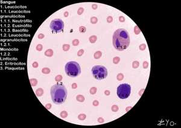

+++
title = "Células do Sangue"
date = "2022-06-17"
#dateFormat = "2006-01-02" # This value can be configured for per-post date formatting
author = ""
authorTwitter = "" #do not include @
cover = ""
tags = ["Histologia", "Atlas Histológico","Células do Sangue", "Desenho Científico", "UNIFAL-MG"]
keywords = ["", ""]
description = ""
showFullContent = false
readingTime = false
hideComments = false
+++
O sangue é um tecido conjuntivo líquido que circula pelo sistema cardiovascular, transportando nutrientes, gases e resíduos metabólicos para todo o organismo. Ele é composto pelo plasma, uma matriz extracelular rica em água e proteínas, e pelos elementos figurados, que desempenham funções vitais de defesa e oxigenação ([acesse o Atlas para mais informações](https://www.unifal-mg.edu.br/histologiainterativa/celulas-do-sangue-e-hematopoiese/)).

As células sanguíneas podem ser divididas da seguinte maneira:

#### Leucócitos (Glóbulos Brancos)
##### Granulócitos (possuem grânulos específicos no citoplasma):
*Neutrófilo*: Identificável pelo núcleo multilobado; é a primeira linha de defesa fagocitária contra bactérias.
*Eosinófilo*: Possui núcleo tipicamente bilobado e grânulos que atuam em reações alérgicas e combate a parasitas.
*Basófilo*: O mais raro; possui grânulos densos (histamina/heparina) que muitas vezes encobrem o núcleo, atuando em processos inflamatórios.

##### Agranulócitos (citoplasma com grânulos não específicos):
*Monócito*: A maior célula do sangue, com núcleo em formato de rim; ao migrar para tecidos, torna-se macrófago.
*Linfócito*: Possui núcleo grande e esférico que ocupa quase toda a célula; é central na resposta imune adaptativa (produção de anticorpos e memória).

#### Eritrócitos (Hemácias)
São as células rosadas e anucleadas em abundância na imagem. Sua forma de disco bicôncavo otimiza o transporte de oxigênio pelos vasos sanguíneos.

#### Plaquetas (Trombócitos)

Pequenos fragmentos celulares (pontos escuros menores) derivados de megacariócitos, fundamentais para a formação do coágulo e estancamento de hemorragias.
#achar uma imagem melhor

