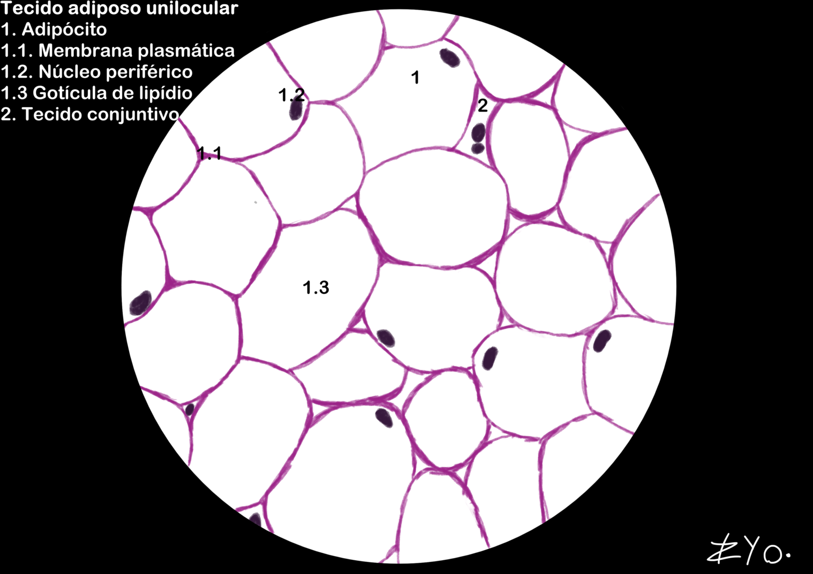
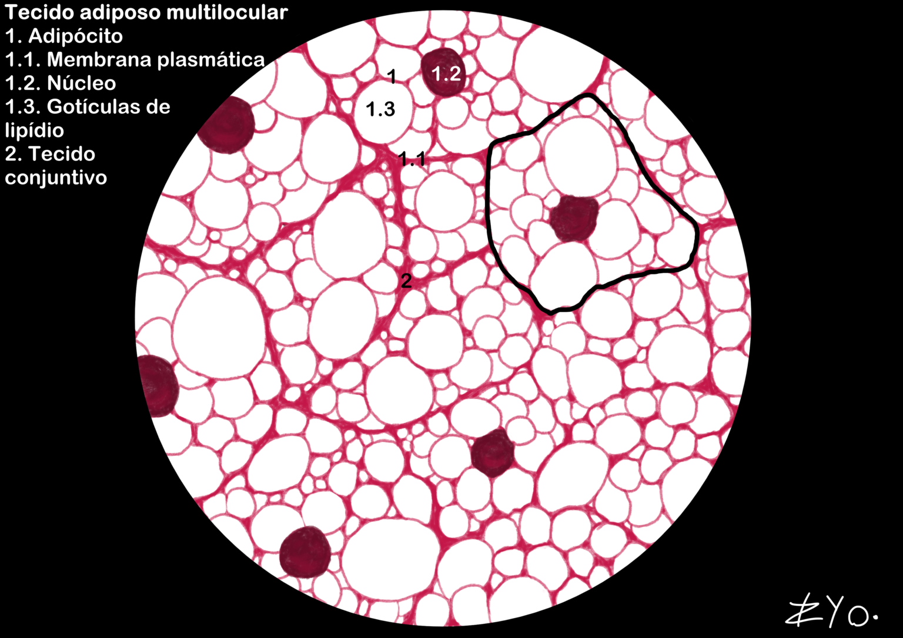

+++
title = "Tecido Adiposo"
date = "2022-06-17"
#dateFormat = "2006-01-02" # This value can be configured for per-post date formatting
author = ""
authorTwitter = "" #do not include @
cover = ""
tags = ["Histologia", "Atlas Histológico","Tecido Adiposo", "Desenho Científico", "UNIFAL-MG"]
keywords = ["", ""]
description = ""
showFullContent = false
readingTime = false
hideComments = false
+++
O tecido adiposo, divido em unilocular e multilocular, é composto por adipócitos, células que armazenam gordura em vacúolos centrais e assumem forma poliédrica quando agrupadas. Ele atua como uma eficiente reserva energética, além de fornecer isolamento térmico e proteção mecânica aos órgãos. Em lâminas histológicas, apresenta aspecto de rede poligonal devido à extração dos lipídios pelos solventes ([acesse o Atlas para mais informações](https://www.unifal-mg.edu.br/histologiainterativa/tecido-adiposo/)).

### Tecido adiposo unilocular
O tecido adiposo unilocular é caracterizado por adipócitos que armazenam uma única gotícula de lipídio (gordura), conferindo-lhes um aspecto de 'favo de mel' ou 'tela de galinheiro'. Ele é encontrado principalmente sob a pele (tecido subcutâneo) e ao redor dos órgãos internos, onde atua como reserva de energia, isolamento térmico e proteção contra impactos.

### Tecido adiposo multilocular
O tecido adiposo multilocular é composto por adipócitos que contêm múltiplas gotículas de lipídio, conferindo-lhes um aspecto granular. Ele é encontrado principalmente em recém-nascidos e em animais hibernantes, onde desempenha um papel crucial na termogênese (produção de calor), ajudando a manter a temperatura corporal. O tecido adiposo multilocular é altamente vascularizado e contém uma grande quantidade de mitocôndrias, o que contribui para a produção de calor e sua coloração marrom característica.
