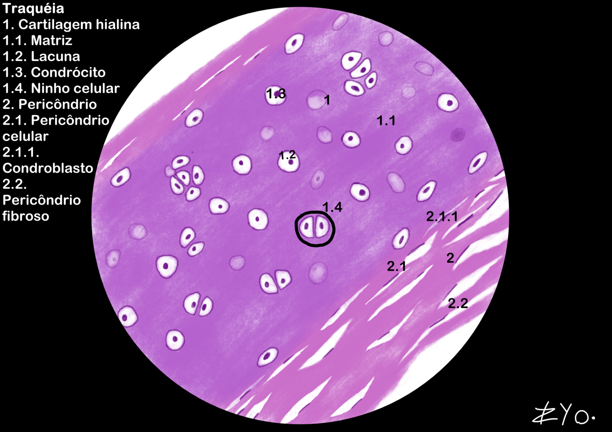
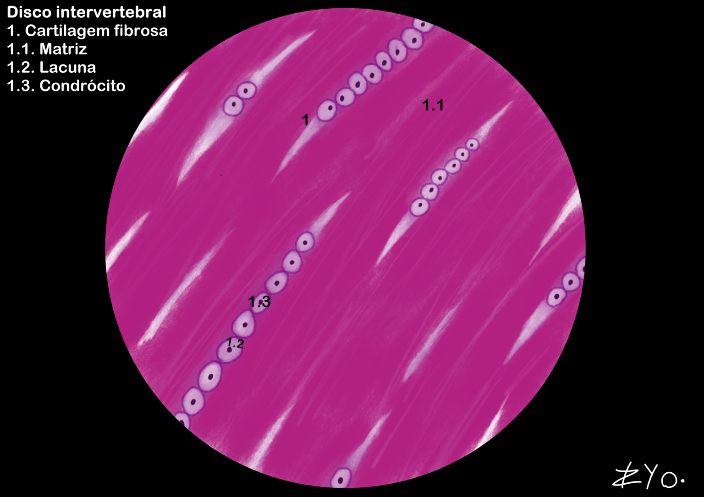

+++
title = "Tecido Cartilaginoso"
date = "2022-06-17"
#dateFormat = "2006-01-02" # This value can be configured for per-post date formatting
author = ""
authorTwitter = "" #do not include @
cover = ""
tags = ["Histologia", "Atlas Histológico","Tecido Cartilaginoso", "Desenho Científico", "UNIFAL-MG"]
keywords = ["", ""]
description = ""
showFullContent = false
readingTime = false
hideComments = false
+++

O tecido cartilaginoso é um conjuntivo avascular que suporta tecidos moles e absorve impactos, dividindo-se em: hialina (colágeno II, comum em articulações e esqueleto embrionário), elástica (flexibilidade para orelha e epiglote) e fibrosa (colágeno I, resistente a tensões). Enquanto as duas primeiras possuem pericôndrio, a fibrocartilagem é nutrida por difusão ou líquido sinovial ([acesse o Atlas para mais informações](https://www.unifal-mg.edu.br/histologiainterativa/tecido-cartilaginoso/)).

### Traqueia
A traqueia é composta por tecido cartilaginoso hialino. Esse tecido forma os anéis cartilaginosos que mantêm a traqueia aberta, permitindo a passagem do ar. Essas estruturas são incompletas na parte posterior, onde a traqueia é flexível para acomodar o esôfago durante a deglutição. O tecido cartilaginoso hialino é caracterizado por uma matriz extracelular homogênea e rica em colágeno tipo II, conferindo resistência e suporte estrutural à traqueia.

### Discos intervertebrais
Os discos intervertebrais são compostos por tecido cartilaginoso fibroso. Eles estão localizados entre as vértebras da coluna vertebral e atuam como amortecedores, absorvendo impactos e permitindo a flexibilidade da coluna. O tecido cartilaginoso fibroso é caracterizado por uma matriz extracelular densa e rica em colágeno tipo I, conferindo resistência à tração e suporte estrutural aos discos intervertebrais.
