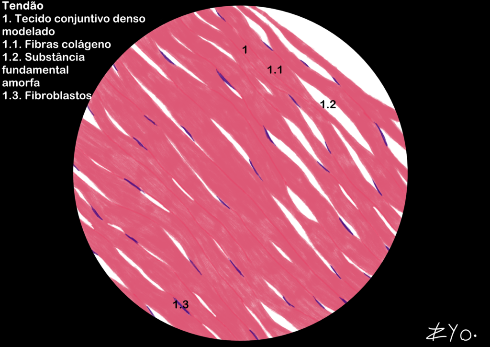

+++
title = "Tecido Conjuntivo"
date = "2022-06-17"
author = "Rafael Martins da Silva Afeto"
cover = ""
tags = ["Histologia", "Atlas Histológico","Tecido Conjuntivo", "Desenho Científico", "UNIFAL-MG"]
categories = ["Material Educativo"]
keywords = ["tecido conjuntivo histologia", "tecido conjuntivo frouxo denso", "tendão colágeno", "o que é tecido conjuntivo", "atlas tecido conjuntivo"]
description = "Tecido conjuntivo frouxo e denso: estrutura, função e ilustração do tendão. Material do Atlas Interativo de Histologia da UNIFAL-MG."
showFullContent = false
readingTime = false
hideComments = false
+++
O tecido conjuntivo caracteriza-se pela predominância da matriz extracelular, composta por fibras e uma 'substância fundamental' viscosa e hidrofílica. Essa matriz, rica em proteoglicanos e glicoproteínas, preenche os espaços intercelulares e atua na adesão, lubrificação e defesa contra patógenos. Diferente de outros tecidos, possui células dispersas, além de vasos sanguíneos e nervos. Ele é divido em tecido conjuntivo frouxo e denso, mas há apenas a ilustração do tecido conjuntivo denso ([acesse o Atlas para mais informações](https://www.unifal-mg.edu.br/histologiainterativa/tecido-conjuntivo/)).

### Tendão

O tendão é composto por tecido conjuntivo denso que conecta os músculos aos ossos. Ele é organizado principalmente por fibras de colágeno alocados em feixes paralelos, o que confere ao tendão uma grande resistência à tração. As células predominantes no tendão são os fibroblastos, que produzem as fibras de colágeno e a substância fundamental amorfa.

