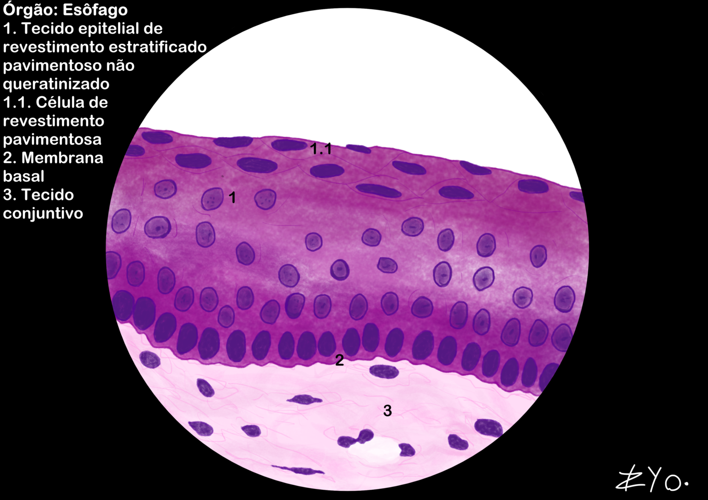
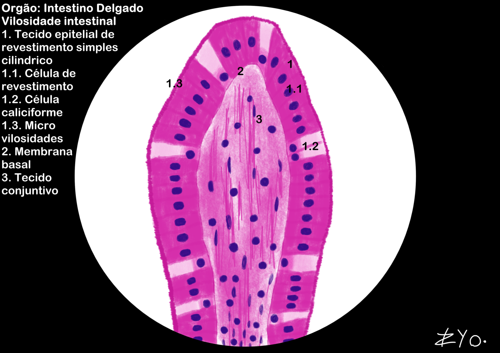
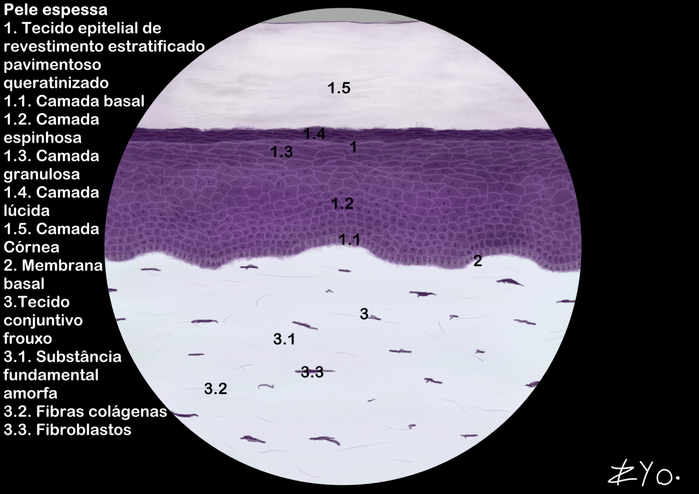
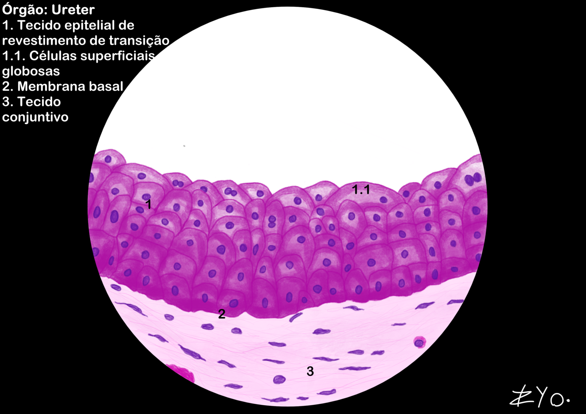
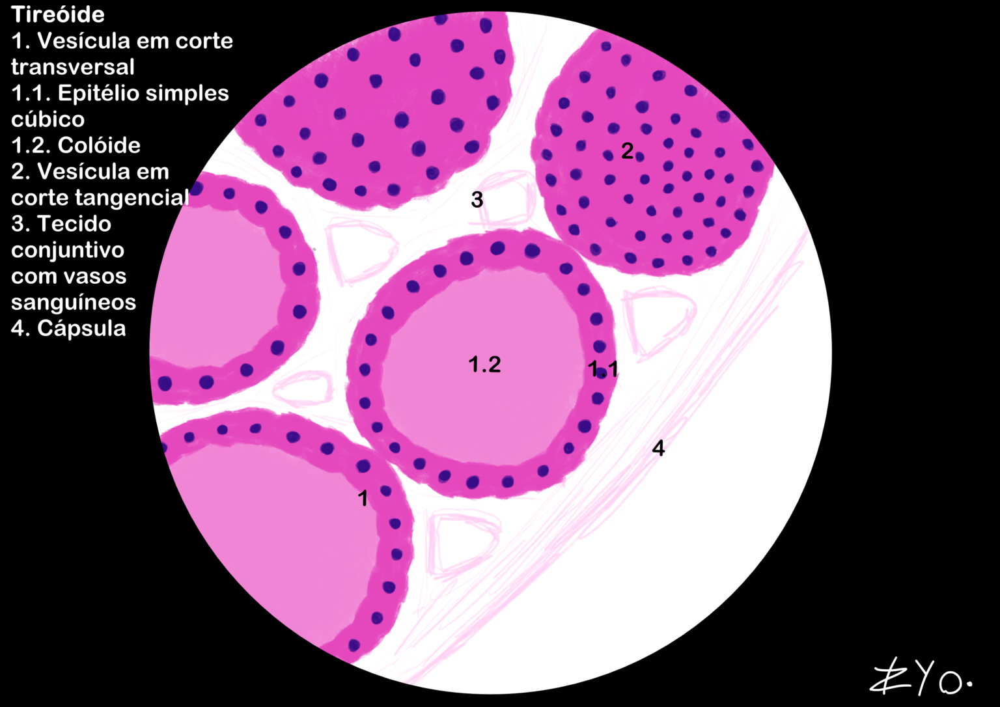

+++
title = "Tecido Epitelial de Revestimento"
date = "2022-06-17"
author = "Rafael Martins da Silva Afeto"
cover = ""
tags = ["Histologia", "Atlas Histológico","Tecido Epitelial", "Desenho Científico", "UNIFAL-MG"]
categories = ["Material Educativo"]
keywords = ["tecido epitelial de revestimento", "epitélio estratificado pavimentoso", "o que é tecido epitelial", "esôfago intestino histologia", "atlas tecido epitelial"]
description = "Tecido epitelial de revestimento: tipos, estrutura e exemplos do esôfago e intestino delgado. Atlas Interativo de Histologia da UNIFAL-MG."
showFullContent = false
readingTime = false
hideComments = false
+++

O tecido epitelial é um dos 4 tecido animais básicos. Ele é composto por células justapostas com pouca matriz extracelular e sem vasos sanguíneos, dependendo, então, do tecido conjuntivo para nutrição. A lâmina basal (ou membrana basal) serve como interface entre esses tecidos, fornecendo suporte estrutural e adesão ([acesse o Atlas para mais informações](https://www.unifal-mg.edu.br/histologiainterativa/tecido-epitelial-de-revestimento-2/)).

### Esôfago

O esôfago conta com um tecido epitelial de revestimento estratificado pavimentoso não queratinizado, que é adaptado para resistir ao atrito causado pela passagem dos alimentos. Ele é composto por várias camadas de células, onde as células mais superficiais são achatadas e as camadas mais profundas são mais cúbicas ou cilindricas. A ausência de queratina permite que o tecido permaneça úmido, facilitando a passagem dos alimentos.

### Intestino delgado

O intestino delgado é revestido por um tecido epitelial de revestimento simples cilindrico, especializado para absorção de nutrientes. Ele é composto por uma única camada de células colunares, que possuem microvilosidades na superfície apical para aumentar a área de absorção. Esse tecido também contêm células calciformes (glândulas secretoras) que produzem muco para proteger o epitélio e facilitar a passagem do conteúdo intestinal.

### Pele espessa

A pele espessa, encontrada em áreas como as palmas das mãos e as plantas dos pés, é revestida por um tecido epitelial de revestimento estratificado pavimentoso queratinizado. Ele é composto por várias camadas de células, onde as células mais superficiais são achatadas e ricas em queratina, uma proteína que confere resistência e impermeabilidade. A queratina ajuda a proteger a pele contra danos mecânicos, perda de água e infecções.

### Ureter

O ureter é revestido por um tecido epitelial de revestimento de transição. Ele é composto por várias camadas de células que podem se esticar e se acomodar ao volume variável do ureter. As células mais superficiais são grandes e arredondadas, enquanto as camadas mais profundas são mais cúbicas. Esse tipo de epitélio é especializado para permitir a distensão do ureter durante o transporte da urina.

### Tireóide

A tireóide é composta por um tecido epitelial de revestimento simples cúbico, que forma os folículos tireoidianos. Esses folículos são estruturas esféricas que armazenam o hormônio tireoidiano em uma substância chamada coloide. As células epiteliais cúbicas são responsáveis pela produção e liberação dos hormônios tireoidianos, que regulam o metabolismo do corpo.

