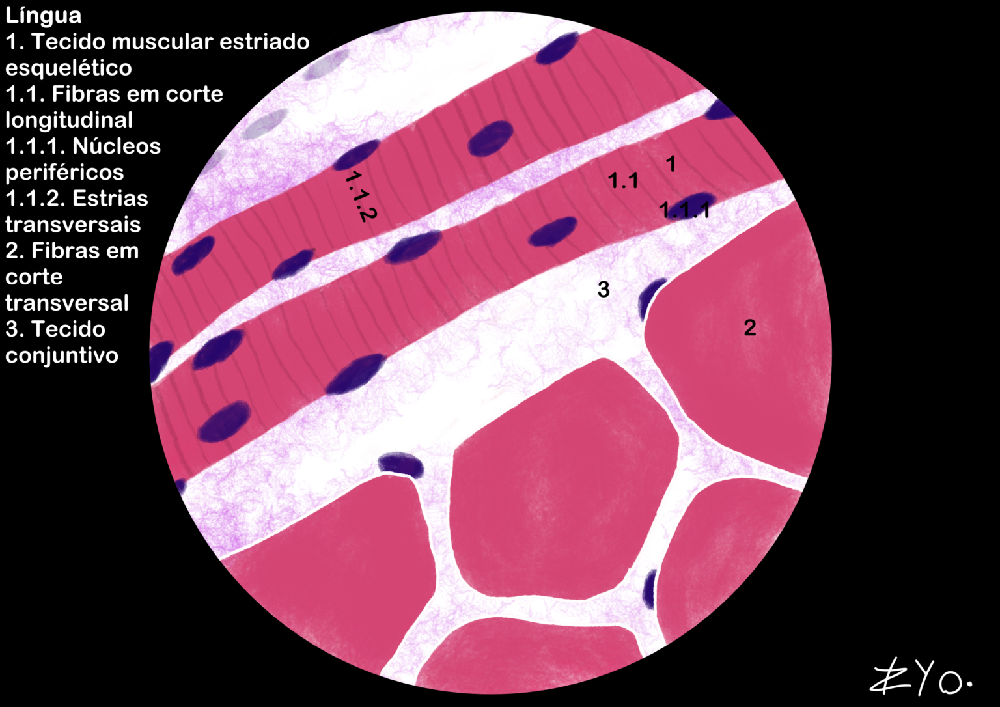
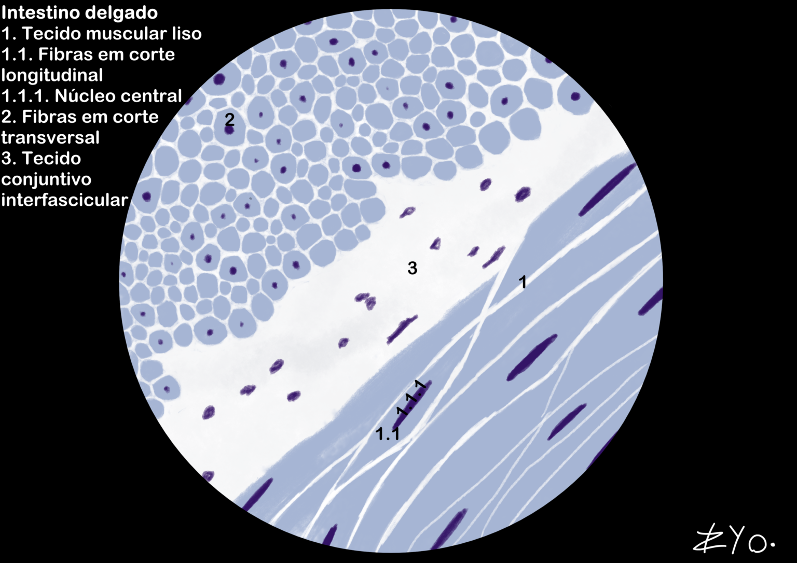
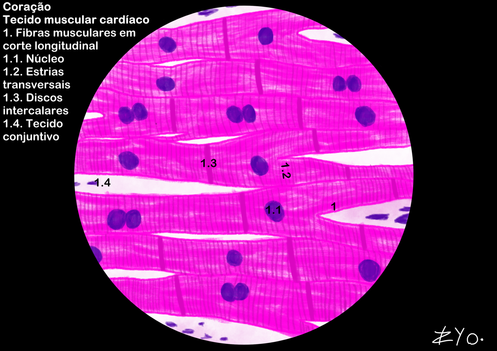

+++
title = "Tecido Muscular"
date = "2022-06-17"
author = "Rafael Martins da Silva Afeto"
cover = ""
tags = ["Histologia", "Atlas Histológico","Tecido Muscular", "Desenho Científico", "UNIFAL-MG"]
categories = ["Material Educativo"]
keywords = ["tecido muscular histologia", "músculo esquelético liso cardíaco", "o que é tecido muscular", "sarcômero contração muscular", "atlas tecido muscular"]
description = "Tecido muscular esquelético, liso e cardíaco: estrutura, função e ilustrações da língua e intestino. Atlas de Histologia da UNIFAL-MG."
showFullContent = false
readingTime = false
hideComments = false
+++

O tecido muscular é composto por fibras alongadas e excitáveis que utilizam ATP para realizar a contração através do deslizamento de miofilamentos de actina e miosina. Estruturalmente, organiza-se em sarcômeros e é envolvido por membranas de tecido conjuntivo (epi, peri e endomísio), dependendo da liberação de cálcio para ativar o processo contrátil. Quanto à regeneração, o músculo liso é o mais eficiente, o esquelético possui capacidade limitada via células satélites e o cardíaco apenas forma cicatriz fibrosa ([acesse o Atlas para mais informações](https://www.unifal-mg.edu.br/histologiainterativa/tecido-muscular/)).

### Língua

A língua é possui fibras, ou seja, células musculares esqueléticas, organizadas em mais de uma direção, o que lhe confere grande mobilidade e flexibilidade. Em torno destas fibras musculares, há tecido conjuntivo, permitindo enervação, vascularização e células de defesa.

### Intestino delgado

O intestino delgado é composto por camadas de tecido muscular liso, organizadas em duas camadas: a camada circular interna e a camada longitudinal externa. Essa organização permite a movimentação coordenada do conteúdo intestinal através de contrações peristálticas, facilitando a digestão e absorção de nutrientes. Entre essas camadas musculares, há tecido conjuntivo.

### Coração

O coração é composto por tecido muscular cardíaco, caracterizado por fibras musculares estriadas e ramificadas, conectadas por discos intercalares. O tecido muscular cardíaco é altamente resistente à fadiga, devido à presença de mitocôndrias abundantes e uma rica vascularização, garantindo o fornecimento constante de oxigênio e nutrientes para sustentar a atividade contrátil contínua do coração. Entre as fibras musculares, há tecido conjuntivo.

