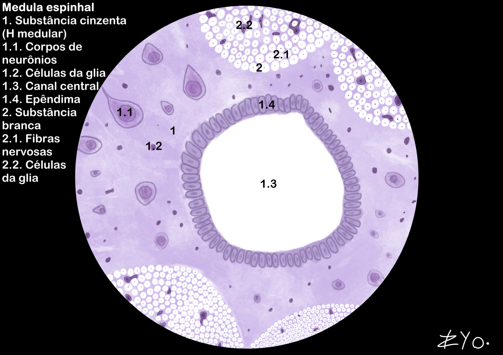
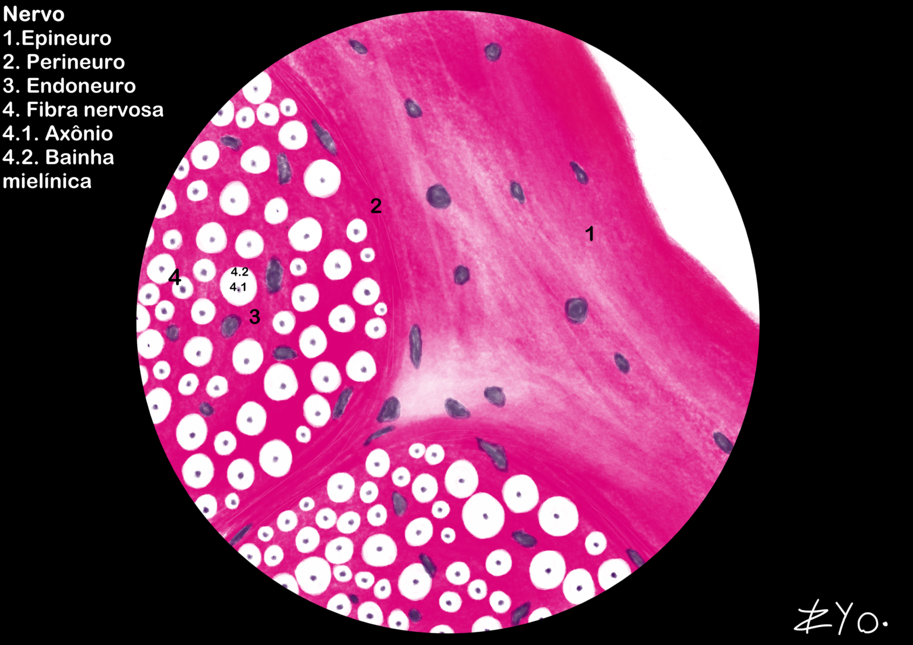

+++
title = "Tecido Nervoso"
date = "2022-06-17"
#dateFormat = "2006-01-02" # This value can be configured for per-post date formatting
author = ""
authorTwitter = "" #do not include @
cover = ""
tags = ["Histologia", "Atlas Histológico","Tecido Nervoso", "Desenho Científico", "UNIFAL-MG"]
keywords = ["", ""]
description = ""
showFullContent = false
readingTime = false
hideComments = false
+++
O tecido nervoso é composto por neurônios, que transmitem impulsos elétricos via axônios e dendritos, e pelas células da glia (como astrócitos e oligodendrócitos), responsáveis pela sustentação, nutrição e isolamento elétrico (bainha de mielina). Anatomicamente, divide-se em SNC (encéfalo e medula), e SNP (nervos e gânglios), que conecta os centros nervosos aos órgãos. O sistema atua na regulação da homeostase e no controle de funções voluntárias e autônomas (simpático e parassimpático) através de neurotransmissores ([acesse o Atlas para mais informações](https://www.unifal-mg.edu.br/histologiainterativa/tecido-nervoso/)).

### Medula espinhal
A medula espinhal é composta por uma substância cinzenta central, onde estão localizados os corpos celulares dos neurônios, e uma substância branca periférica, formada por axônios mielinizados que conduzem impulsos nervosos. A medula espinhal é responsável por transmitir informações sensoriais do corpo para o cérebro e comandos motores do cérebro para o corpo, além de ser um centro de reflexos rápidos e automáticos.

### Nervos
Os nervos são estruturas do sistema nervoso periférico compostas por feixes de axônios, envoltos por tecido conjuntivo. Ao fazer um corte transversal, observa-se sua organização entre: Epineuro, Perineuro e Endoneuro; enquanto que a fibra nervosa se organiza em axônios envolvos pela bainha de mielina.
