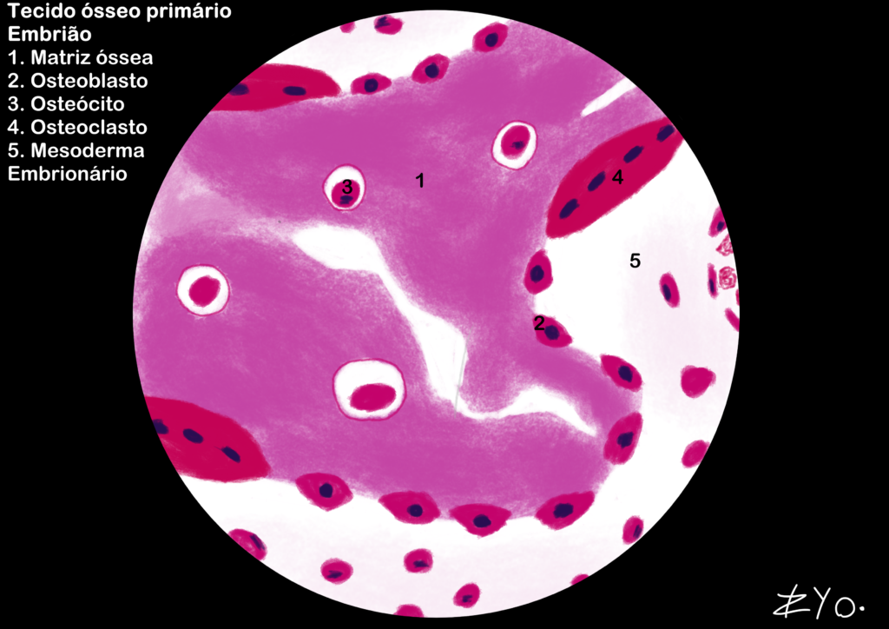
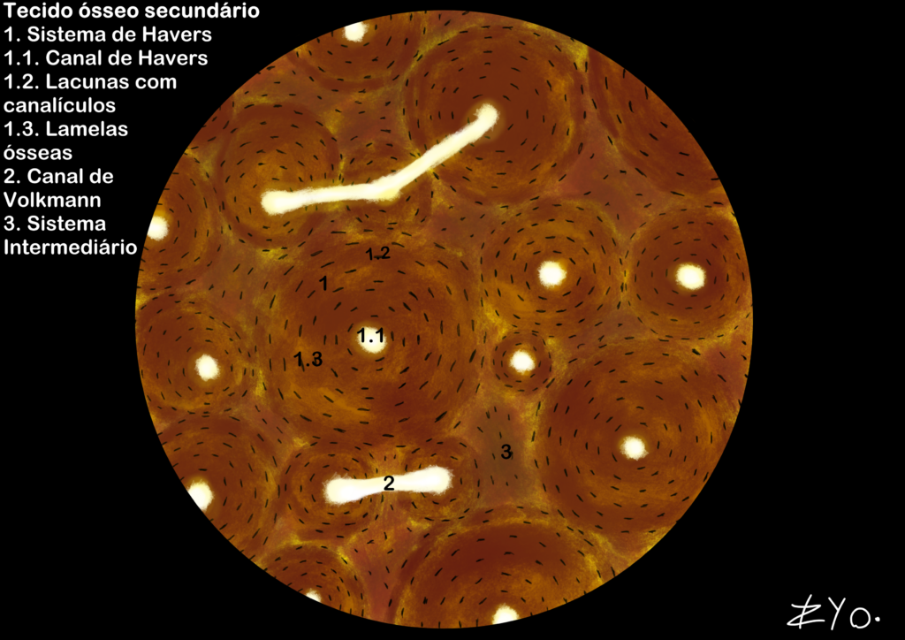
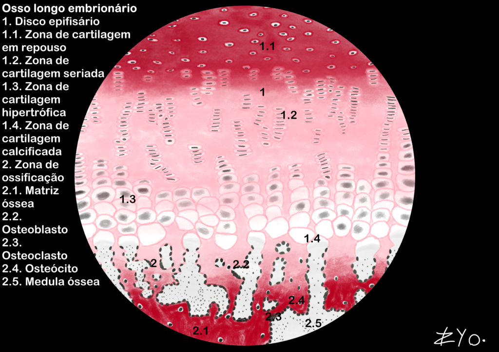

+++
title = "Tecido Ósseo"
date = "2022-06-17"
#dateFormat = "2006-01-02" # This value can be configured for per-post date formatting
author = ""
authorTwitter = "" #do not include @
cover = ""
tags = ["Histologia", "Atlas Histológico","Tecido Ósseo", "Desenho Científico", "UNIFAL-MG"]
keywords = ["", ""]
description = ""
showFullContent = false
readingTime = false
hideComments = false
+++

O tecido ósseo é um conjuntivo especializado onde a matriz mineralizada (cristais de hidroxiapatita) fornece dureza e a parte orgânica (colágeno tipo I) garante flexibilidade. Atua no suporte mecânico, proteção de órgãos vitais e reserva de íons como cálcio e fosfato, sendo uma estrutura dinâmica em constante remodelação. Além disso, abriga a medula óssea e potencializa movimentos através do sistema de alavancas com os músculos esqueléticos ([acesse o Atlas para mais informações](https://www.unifal-mg.edu.br/histologiainterativa/tecido-osseo/)).

### Tecido ósseo primário
O tecido ósseo primário é caracterizado por uma matriz óssea recém-formada e desorganizada. Ele é encontrado principalmente durante o desenvolvimento embrionário e em processos de reparação óssea, como fraturas. O tecido ósseo primário é composto por fibras de colágeno tipo I dispostas de maneira irregular, conferindo-lhe uma aparência menos densa e mais flexível em comparação com o tecido ósseo maduro. Ele é posteriormente remodelado para formar o tecido ósseo secundário, que é mais organizado e resistente.

### Tecido ósseo secundário
O tecido ósseo secundário, também conhecido como tecido ósseo lamelar, é caracterizado por uma matriz óssea organizada em camadas ou lâminas. Ele é encontrado em ossos maduros e é o resultado do processo de remodelação óssea, onde o tecido ósseo primário é substituído por tecido ósseo mais resistente e organizado. Ele é responsável por fornecer suporte estrutural ao esqueleto e proteger os órgãos vitais, além de atuar como reserva de íons e local de produção de células sanguíneas na medula óssea.

### Osso longo embrionário
O osso longo embrionário desenvolve-se através da ossificação endocondral, onde um molde de cartilagem hialina é gradualmente substituído por tecido ósseo primário. Esse processo ocorre em zonas distintas: os condrócitos proliferam em fileiras, sofrem hipertrofia e a matriz é calcificada, permitindo que osteoblastos depositem matriz óssea e osteoclastos modelem o canal medular. Essa dinâmica é essencial para a estruturação do esqueleto e o crescimento longitudinal do organismo durante a fase embrionária.
