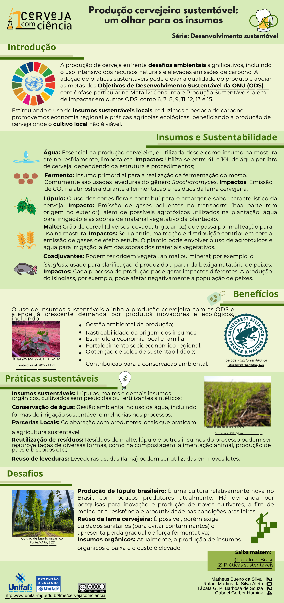

+++
date = '2024-04-01'
draft = false
title = 'Infográfico: Produção cervejeira sustentável, um olhar para os insumos - série Desenvolvimento sustentável - Ciência da Cerveja - UNIFAL-MG'
author = "Rafael Martins da Silva Afeto"
cover = ""
tags = ["Ciência da Cerveja", "Sustentabilidade", "Infográfico", "UNIFAL-MG"]
categories = ["Material Educativo"]
keywords = ["produção cervejeira sustentável", "infográfico cerveja", "insumos cerveja sustentabilidade", "ciência da cerveja UNIFAL", "cerveja sustentável"]
description = "Infográfico sobre práticas sustentáveis na produção de cerveja com foco nos insumos. Série Desenvolvimento Sustentável da disciplina Ciência da Cerveja, UNIFAL-MG."
+++

O infográfico "Produção cervejeira sustentável, um olhar para os insumos" é uma representação visual que destaca a importância de práticas sustentáveis na produção de cerveja, com foco nos insumos utilizados.

O infográfico é parte da série "Desenvolvimento sustentável" da disciplina "Ciência da Cerveja" da UNIFAL-MG, que visa promover a conscientização sobre a sustentabilidade na indústria cervejeira. Para acessar esse e outros infográficos completos, clique [aqui](https://www.unifal-mg.edu.br/lme/cervejacomciencia/materiais/infograficos/).

A disciplina é dada pelo docente Gabriel Hornink, do Instituto de Ciências Biológicas (ICB) da UNIFAL-MG.

### Infográfico: Produção cervejeira sustentável, um olhar para os insumos

