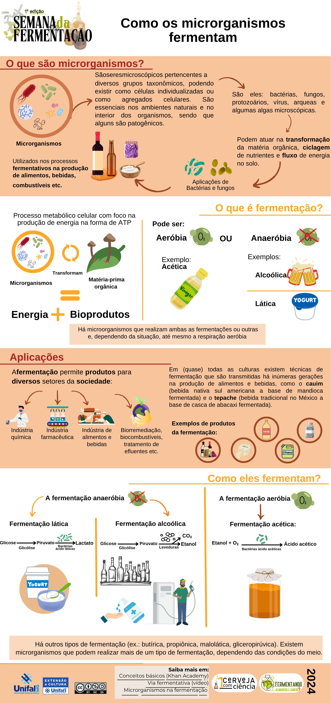

+++
date = '2024-09-16'
draft = false
title = '1ª Semana Da Fermentacao - UNIFAL-MG'
cover = ""
+++
A 1ª Semana da Fermentação da UNIFAL-MG foi um evento dedicado a explorar o fascinante mundo da fermentação, destacando sua importância histórica, científica e cultural. O evento contou com palestras e atividades interativas que abordaram diversos aspectos da fermentação, desde os processos biológicos envolvidos até suas aplicações na produção de alimentos, bebidas e biotecnologia.

Sob orientação do professor Gabriel Hornink, do Instituto de Ciências Biológicas (ICB) da UNIFAL-MG, e do técnico Gustavo Silveira, eu e minha dupla, Bianca Soares, realizamos um banner sobre como os microorganismos funcionam ([acesse o banner completo aqui](https://www.researchgate.net/publication/384011832_Como_os_microrganismos_fermentam_painel)) e um infográfico de mesmo tema ([acesse o infográfico completo aqui](https://www.researchgate.net/publication/384011528_Como_os_microrganismos_fermentam_infografico)).

### Banner: Como os microrganismos fermentam?

### Infográfico: Como os microrganismos fermentam?
