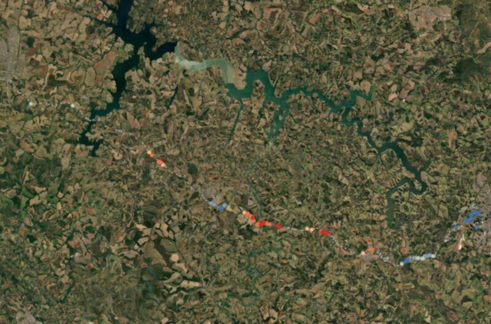
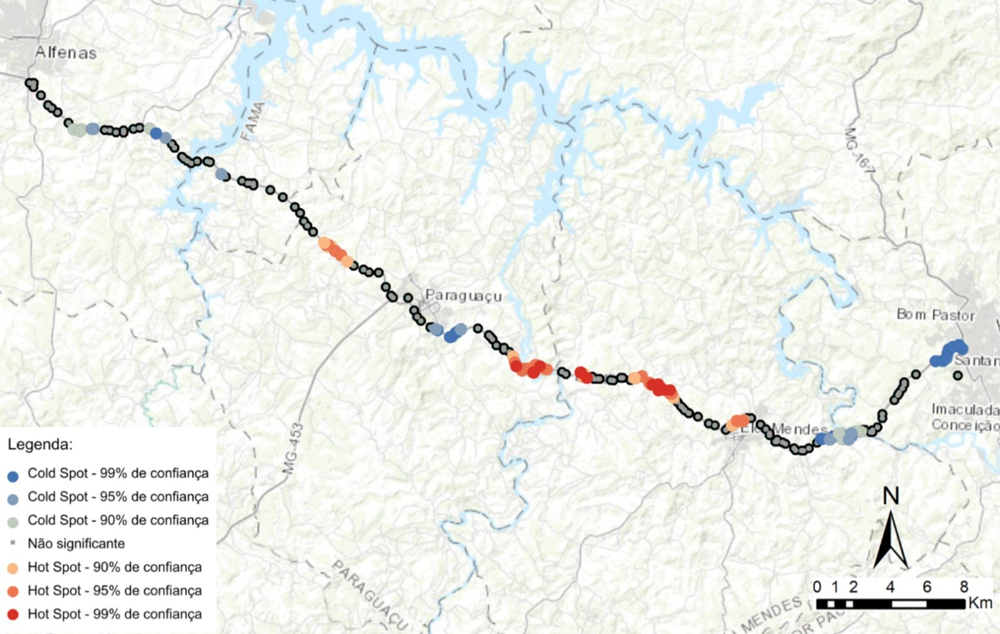
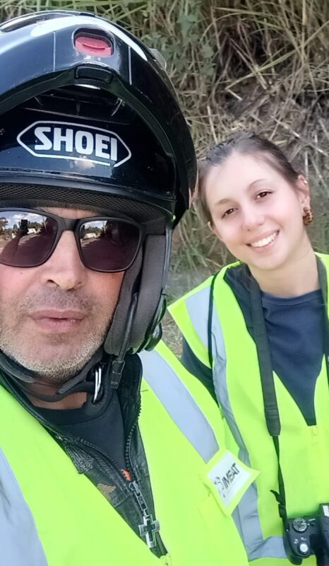
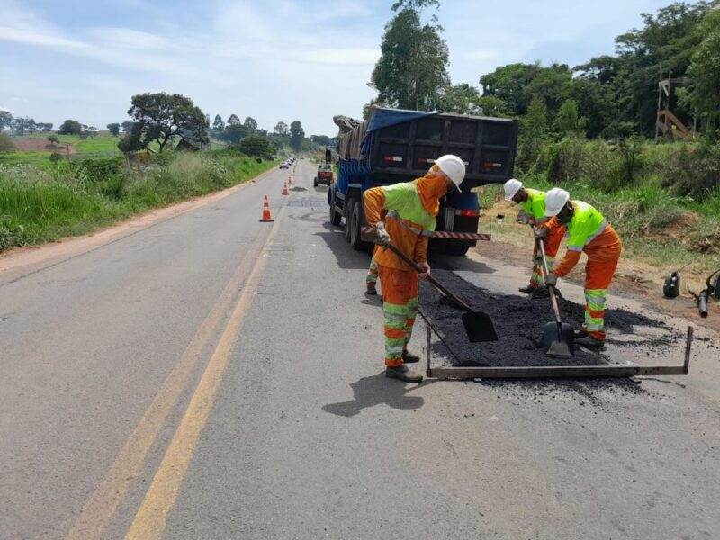

+++
title = "Trecho Alfenas x Elói Mendes possui maior incidência de atropelamento de animais silvestres e domésticos da rodovia MG-491"
subtitle = "Estudo realizado por pesquisadores da UNIFAL-MG identifica acidentes que prejudicam tanto a fauna local quanto a segurança dos viajantes"
date = "2024-09-25"
#dateFormat = "2006-01-02" # This value can be configured for per-post date formatting
author = ""
authorTwitter = "" #do not include @
cover = "danna-em-campo.jpg"
#
tags = ["Atropelamentos", "Ciência", "FAPEMIG", "Iniciação Científica", "Projeto +Ciência", "UNIFAL-MG"]
keywords = ["", ""]
description = ""
showFullContent = false
readingTime = false
hideComments = false
+++
Uma pesquisa realizada pela recém-graduada em Ciências Biológicas pela UNIFAL-MG Danna Perondi Ferreira e orientada pela professora Érica Hasui (Instituto de Ciências da Natureza) foi responsável por indicar locais, na rodovia MG-491, com o maior índice de atropelamento de animais silvestres e domésticos, conhecidos como hotspots. Realizado entre outubro de 2023 e abril de 2024, o estudo também identificou os fatores que interferem no atropelamento.

O trecho estudado se encontra entre as cidades mineiras de Alfenas e Varginha, no entanto, os locais com maior incidência de atropelamentos de animais silvestres foi entre os km 210 e 218, entre Paraguaçu e Elói Mendes. Já para os animais domésticos, o km 196, entre Alfenas e Paraguaçu, teve seu maior destaque.

Durante o período de realização do estudo, a pesquisadora fotografou animais atropelados para posterior análise e também anotou os padrões geográficos e do ambiente próximo aos animais encontrados.

O local de escolha do estudo, atualmente está sob administração do grupo EPR Vias do Café e já é conhecido pela grande quantidade de atropelamentos de animais. A pesquisa mostra que estes acidentes prejudicam tanto a fauna local, com a morte destes animais, quanto a segurança dos viajantes.

Pontos de maior incidência de atropelamentos. (Imagens: Reprodução/TCC Danna Ferreira)

## Motivação para o tema de pesquisa

Intitulado “Avaliação de hotspots de atropelamento de animais silvestres na rodovia MG-491”, o estudo é fruto do trabalho de conclusão de curso (TCC), vinculado ao projeto de iniciação científica “Biodiversidade e serviços associados: PELD Corredor Cantareira Mantiqueira”.

A proposta do TCC veio a partir das viagens que a pesquisadora fazia entre Alfenas e sua cidade natal. “Eu sou de Três Corações e sempre que ia pra lá nos finais de semana eu via muitos animais atropelados, isso sempre me chateava e eu ficava me perguntando sobre o motivo de tantas ocorrências, e se havia algo que eu pudesse fazer. Procurei saber mais sobre o tema, encontrei vários artigos e conversei com a Érica [Hasui], minha orientadora, sugerindo o tema“, informa Danna Ferreira. “A partir daí, vimos a possibilidade de desenvolver essa pesquisa para entender melhor os padrões de atropelamento e a partir disso sugerir medidas que pudessem mudar essa realidade”, complementa.

Para auxiliar na identificação dos animais encontrados, outros pesquisadores da UNIFAL-MG e da Universidade Federal de Lavras (UFLA) estiveram presentes na força-tarefa. Danna Ferreira conta que a família e seu namorado foram de grande ajuda para essa pesquisa acontecer. “Minha família e meu namorado se dispuseram na hora de fazer as coletas comigo, em especial meu pai, com quem fiz a maior parte da pesquisa”, compartilha.

Danna Ferreira acompanhada pelo pai Kerlei Ferreira durante a coleta de dados. (Foto: Arquivo Pessoal)

## Rodovias e a fragmentação de hábitat

No trabalho, a autora reforça que a expansão de pastagem, construção de indústrias ou abertura de novas rodovias impactam diretamente a cobertura vegetal e o uso dado para as porções de terra.

De acordo com o estudo, o que é visto como progresso para os seres humanos pode significar destruição para a fauna e flora, já que a urbanização e construção de infraestruturas fragmentam os habitats naturais. Isso transforma áreas, antes contínuas, em porções menores e isoladas. Para a autora, o grande problema é que essa fragmentação dificulta o movimento dos animais entre essas áreas, devido à falta de conectividade entre os fragmentos. Além disso, conforme dados do Centro Brasileiro de Estudos em Ecologia de Estradas (CBEE) da Universidade Federal de Lavras, estima-se que cerca de 450 milhões de animais silvestres são atropelados todos os anos no Brasil, ameaçando gravemente a biodiversidade do país.

Danna Ferreira destaca que, após setembro de 2023, a rodovia MG-491, anteriormente sob administração estadual, foi concedida ao grupo EPR Vias do Café no programa de Concessões Rodoviárias do Governo de Minas Gerais. “A concessionária assumiu a responsabilidade pelo lote 3 – Varginha – Furnas, que inclui a MG 491”, explica a autora.A pesquisadora ressalta ainda que o contrato de concessão tem duração de 30 anos e prevê uma série de melhorias, como correções na pista, construção de praças de pedágio, limpeza das áreas laterais e revitalização da sinalização, tudo visando aumentar a segurança viária. “É importante considerar a segurança da fauna que habita a região e se movimenta na paisagem, já que é visível a alta incidência de atropelamentos de animais na rodovia”, alerta.

(Divulgação: EPR Vias do Café)

## Quais foram as vítimas?

Durante o período de coleta, a pesquisadora encontrou 189 animais atropelados, sendo eles, silvestres e domésticos. Dos animais silvestres, a maioria encontrada foi de mamíferos, como capivaras, ouriços-cacheiro, gambás e tatus. Também foi encontrado, em menor proporção, tapitis, um mamífero que se encontra em perigo de extinção.

Algumas aves, como os canários-da-terra e urubus-de-cabeça-preta também foram bastante encontrados. Com relação aos répteis, teiús (lagartos) também foram vistos atropelados. De anfíbios, não foi possível identificar as espécies.

Segundo o estudo, as espécies mais abundantes localmente e/ou generalistas (capazes de sobreviver em diversas condições e se alimentar de diversas fontes de alimento), são as espécies que apresentam maior movimentação entre os fragmentos e rodovias, por isso, tendem a ser os mais atingidos.

Vale também para espécies noturnas, como os gambás, que podem ser vítimas pelo fato de a visibilidade do motorista à noite ser reduzida e os faróis desnortearem os animais.

Danna Ferreira cita, ainda, as espécies necrófagas, ou seja, que se alimentam de animais mortos, como urubus, que sofrem por serem atraídas por carcaças nas rodovias, aumentando a chance de serem vítimas.

Cães e gatos foram comumente vistos, atropelados em rodovias longe de zonas urbanas. Por serem animais domésticos, alguns fatores como a presença de roças e sítios próximos às estradas, oferta de alimento, como carniça e lixo e o abandono destes animais, estão diretamente relacionados com os atropelamentos deles.

## O ambiente influencia?

Danna Ferreira nos mostra, em seu estudo, que o ambiente é um fator crucial para a definição dos hotspots, ou locais críticos, já que ambientes mais preservados, como próximos a áreas de vegetação florestal natural, costumam ter mais atropelamentos. Enquanto que, locais próximos a ambientes degradados, como plantações florestais, ou distantes de algum recurso hídrico, os atropelamentos diminuem. Como enfatiza a autora, isso se relaciona com a diminuição de recursos, já que, com essas plantações, como as de eucalipto, comuns na região, há um empobrecimento do solo e de recursos hídricos, o que não é atrativo para animais, tendo menos biodiversidade e, consequentemente, menos atropelamentos.

## Desdobramentos do estudo

Os dados do estudo apontam para a necessidade de pensar em medidas mitigadoras. No início de 2023, Guilherme Abraão, ambientalista e sociólogo, encaminhou ao Ministério Público uma proposta de medidas de preservação de fauna no edital de concessão de rodovias, o que inclui o trecho estudado. No entanto, essas medidas não chegaram até agora.

“Eu não via medidas mitigadoras para atropelamento de animais nessa rodovia nem antes de iniciar a pesquisa”, informou Danna Ferreira. “[o grupo EPR Vias do Café] iniciou diversas obras ao longo da pista, mas ainda não vejo medidas voltadas para redução de atropelamento”, argumenta.

Segundo a autora e outros estudos sobre o tema, medidas como pontes para travessia de animais, radares em pontos estratégicos, cercas laterais, entre outras, auxiliariam na redução de atropelamentos. “São importantes para, além de evitar que animais morram atropelados, permitir que tanto eles como os seres humanos se movimentem com segurança, já que esses acidentes também são um risco para nós.”

*Texto elaborado sob supervisão e orientação de Ana Carolina Araújo, jornalista da Universidade Federal de Alfenas (UNIFAL-MG).*

Visite a [página da UNIFAL-MG](https://jornal.unifal-mg.edu.br/trecho-alfenas-x-paraguacu-possui-maior-incidencia-de-atropelamento-de-animais-silvestres-e-domesticos-da-rodovia-mg-491/) para acessar o texto na íntegra.
