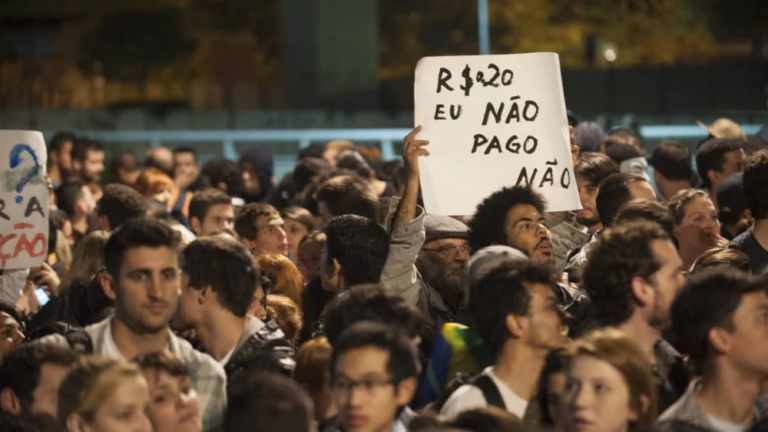
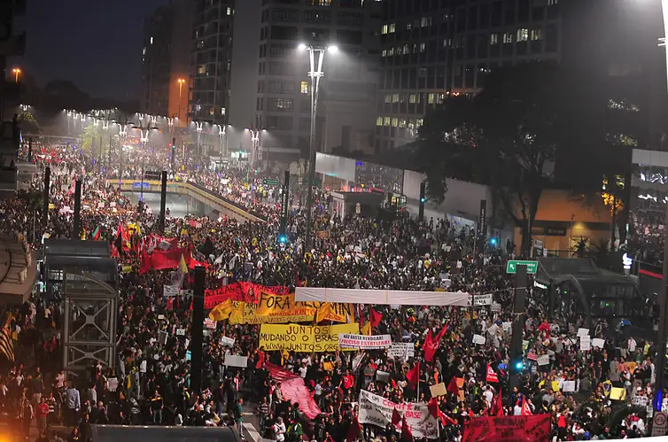
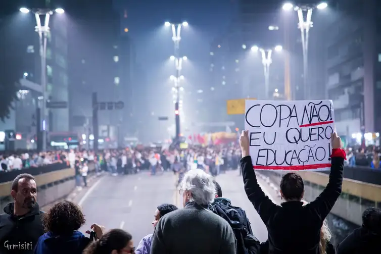
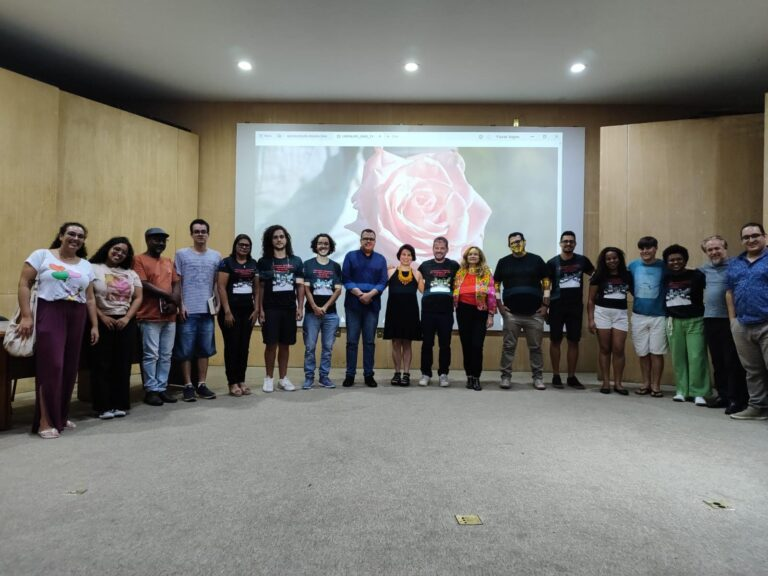

+++
title = "Protestos que ocorreram por todo o Brasil em 2013 ainda impactam a estrutura política atual"
subtitle = "Pesquisadores da UNIFAL-MG mostram como o legado educacional e político das Jornadas de 2013 impulsionaram ações coletivas em todo o país"
date = "2024-10-30"
author = "Rafael Martins da Silva Afeto"
cover = "jornadas-2013.jpg"
tags = ["Jornadas de 2013", "Jornadas de Junho", "Projeto +Ciência", "UNIFAL-MG"]
categories = ["Ciências Sociais"]
keywords = ["jornadas de junho 2013", "protestos Brasil 2013", "legado político jornadas", "movimentos sociais Brasil", "pesquisa UNIFAL-MG"]
description = "Estudo da UNIFAL-MG analisa como as Jornadas de 2013 influenciaram a estrutura política e educacional brasileira, a partir de entrevistas com pesquisadores e ativistas."
showFullContent = false
readingTime = false
hideComments = false
+++

Há 11 anos, aconteciam protestos de escala nacional no Brasil, o que ficou conhecido como **“As Jornadas de 2013”**. Esse momento histórico brasileiro garantiu que, em 2023, o pesquisador Luís Antonio Groppo, professor do Instituto de Ciências Humanas e Letras (ICHL) da UNIFAL-MG, junto aos acadêmicos Emanoely Sigiani, Nikole Mendonça de Almeida e Lucas Vieira, pudessem realizar um estudo para entender como os protestos influenciaram a estrutura política e educacional brasileira atual.

Intitulado [“Interpretações das dimensões educacionais das Jornadas de 2013: debates, sentidos e legados”](https://www.scielo.br/j/tes/a/JYLhhBjyHFwkCCMCNnZ8QBh/?format=html&lang=pt), o estudo está vinculado à pesquisa “Dimensões Educacionais das Jornadas de 2013: pautas educacionais, experiências escolares e formação política de jovens em protesto” do [Programa de Pós-Graduação em Educação (PPGE)](https://www.unifal-mg.edu.br/ppge/) da UNIFAL-MG. A pesquisa foi realizada por meio de entrevistas com 18 pesquisadores da área e com ativistas atuantes nos protestos da época.

Segundo o professor Luís Groppo, o estudo é resultado de um dos produtos relacionados à segunda fase da pesquisa. Conforme o pesquisador, as entrevistas permitiram que os participantes falassem sobre a relação entre as Jornadas e as transformações sociais e políticas posteriores e aspectos educacionais das Jornadas.

Para os autores do estudo, o principal resultado da pesquisa foi a possibilidade de preparar a equipe para as entrevistas da terceira fase. Nesta etapa, foram entrevistadas 36 pessoas que, em 2013, eram jovens ativistas ou  militantes de organizações que tiveram importante atuação nas Jornadas.

“As entrevistas nos trouxeram informações relevantes sobre o perfil juvenil majoritário de 2013, mas não exclusivo, assim como as diferenças entre as pautas iniciais, mais centradas no direito à cidade e as pautas na fase massiva, plurais e genéricas”, explica o professor Luís Groppo.

## O que foram as Jornadas de 2013

Aumento da tarifa dos transportes públicos em São Paulo foi uma das pautas dos protestos de 2013. (Foto: Divulgação/Agência Brasil)

As Jornadas de 2013 foram uma série de protestos realizados nos anos de 2010, caracterizados pela ocupação de espaços públicos pelos manifestantes. O ciclo de protestos foi impulsionado pela crise econômica mundial de 2007-2008.

Aqui no Brasil, para Luís Groppo, durante as Jornadas, os protestos contra o aumento da tarifa dos transportes públicos em São Paulo, capital, em junho, convocados pelo Movimento Passe Livre de São Paulo (MPL-SP) foram muito importantes. No entanto, ele e os colegas pesquisadores também levantam o período que antecede a junho, o que eles chamam de latência.

”A latência é quando movimentos e organizações como o MPL de vários estados se organizaram, ao lado dos Comitês Populares da Copa, denunciando as violações dos direitos humanos pelas obras para os megaeventos esportivos, Copa do Mundo de 2014 e Olimpíadas de 2016”, explica. “Em Porto Alegre/RS, já assistira em março de 2013 um bem sucedido movimento contra o aumento das tarifas de ônibus organizado pelo Bloco de Lutas pelo Transporte Público de Porto Alegre”, complementa.

Os pesquisadores têm preferido se referir à Jornada apenas como ciclo de protestos de Jornadas de 2013, sem o “Junho”. “Após junho, os protestos continuam, e em lugares como Belo Horizonte e Rio de Janeiro, na verdade, atingem o seu auge”, afirma Luís Groppo. Para os pesquisadores, o ápice dos protestos foi marcado pela existência de manifestantes progressistas e conservadores nas ruas. O movimento deixou de ser essencialmente de esquerda, ganhando atores com ideologias liberais e conservadoras.

A pesquisa mostrou que  as Jornadas repercutiram nacionalmente, e se interiorizaram, levando ao conjunto de ações coletivas com maior adesão popular do país. “Em dado momento, os protestos se massificaram ainda mais e outras demandas, em geral difusas e ambíguas, se somaram”, ressalta Luís Groppo. Ele continua: “Mas após junho, a tendência foi a de protestos com pautas novamente progressistas e bem definidas, como greves defensivas em torno dos direitos trabalhistas, movimento por moradia e protestos contra a Copa e Olimpíadas”, afirma.

## A visão dos entrevistados sobre as Jornadas de 2013

Protestos de junho de 2013 reuniram multidões em várias cidades do país. (Foto: Marcelo Camargo/Agência Brasil)

Para os autores do estudo, o material coletado nas entrevistas aponta que as Jornadas foram um evento complexo. “A parte mais interessante deste artigo é a relativa convergência das interpretações das pesquisadoras e pesquisadores sobre as Jornadas, a despeito de certa diferença na avaliação de seus legados”, destaca Luís Groppo.

Conforme o pesquisador, as Jornadas são interpretadas como um fenômeno histórico muito complexo, com diferentes camadas históricas justapostas, assim como classes sociais, pautas e ideologias políticas. “As Jornadas demonstram os limites da democracia representativa e do pacto inaugurado pelo lulismo, assim como efeitos da crise econômica mundial”, pontua.

Os protestos iniciaram como uma proposta progressista, que juntava autonomistas e socialistas críticos ao PT, mobilizando jovens de classes populares. Para Paulo Arantes, do Departamento de Filosofia da Universidade de São Paulo, professor e um dos entrevistados, as Jornadas têm um caráter de Movimento Estudantil. “Se eu penso na influência do MPL, se eu penso que tudo começou por causa da tarifa zero para todos os cidadãos, mas sobretudo Catraca Livre para os estudantes, e que isso foi o estopim, eu posso então dizer que foram os estudantes secundaristas organizados que fizeram Junho”, conclui.

Para Ana Karina Brenner, docente do Programa de Pós-Graduação em Educação da Universidade do Estado do Rio de Janeiro e entrevistada, a complexidade das Jornadas se dá também pela grande captura de mídia realizada entre os protestos. “Teve uma captura da mídia, em determinados setores da sociedade, para uma interpretação reacionária que, de fato, ajudou a construir um movimento da direita reacionária”, afirma. “Não existia no país, inclusive, ninguém tinha coragem de dizer que era de direita”, observa e continua: “Agora a gente vê que um monte de gente diz que é de direita”, explica.

Outro fator levantado em algumas das entrevistas foi o fato de as Jornadas garantirem um intenso processo de subjetivação política, ou seja, o processo pelo qual indivíduos e grupos formam suas identidades políticas, crenças e ações em resposta aos contextos sociais e políticos.

## Quais são as consequências das Jornadas de 2013?

Movimento Passe Livre organizou a manifestação feita em 20 de junho de 2013 na capital paulista. (Foto: Gianluca Ramalho Misiti/Flickr)

Para os entrevistados, as Jornadas de 2013 garantiram consequências tanto positivas quanto negativas. Como consequências positivas, há, por exemplo, a visibilidade de pautas novas ou que antes eram pouco visíveis. Segundo os autores, essas pautas, agora, não são vistas apenas em novos movimentos sociais, mas também em políticas públicas ou campanhas eleitorais, como o transporte público, incluindo o avanço do tema da tarifa zero, a mobilidade urbana e o direito à cidade.

“Hoje você tem prefeituras que têm uma preocupação essencial com a questão do transporte público e do acesso ao transporte público, ainda muito precarizado. Mas já se fala em gratuidade de uma maneira mais tranquila, uma coisa que era inimaginável”, afirma Bárbara Lou Dias, do Instituto de Filosofia e Ciências Humanas da Universidade Federal do Pará, professora, advogada e uma das entrevistadas, reforçando a ideia de que houve uma continuidade de pautas de importância pública.

Para Paulo Arantes, as Jornadas trouxeram a abertura do horizonte para a esperança, uma vez que os legados desse ciclo de protestos são: continuidade de manifestações progressistas, demonstração da capacidade de mobilização popular, reconhecimento pelas novas gerações do potencial das mobilizações juvenis, ampliação das possibilidades de participação política das pessoas, com o questionamento das formas tradicionais de fazer política, politização da sociedade civil, aprendizado do fazer político no espaço público e de instrumentos das políticas públicas sobre o espaço urbano, proliferação e diversificação dos coletivos e descoberta de que é possível fazer mudanças por meio da política.

Outra docente entrevistada, Olívia Perez, professora de Ciência Política e de Políticas Públicas da Universidade Federal do Piauí (UFPI), explicitou que muitos jovens foram socializados politicamente em 2013 com essa ideia de antipolítica institucional, antissistema. “A formação do que a gente disse que são novas formas de organização, embora tenha uma novidade, carrega muito de ideias antigas, que é essa crítica à hierarquia das instituições políticas tradicionais, como os partidos políticos, e um recado de que todas as instituições políticas devem ser abertas, abertas à diversidade, à entrada de mulheres, negros, jovens, moradores de periferia, de modo interseccional”, ressalta.

Entre as consequências negativas, as citadas nas entrevistas estão relacionadas à ascensão da direita e extrema-direita nos anos seguintes às Jornadas de 2013. Os participantes também afirmam que a forma como o PT lidou com as demandas das Jornadas após sua vitória eleitoral em 2014 e como o sistema político se protegeu contra as reformas demandadas pela sociedade civil auxiliaram na ascensão da extrema-direita no país, bem como as transformações sociais e políticas que favoreceram a médio prazo a extrema-direita. Alguns dos entrevistados explicitam também que a fase massiva das Jornadas ampliou a visibilidade da extrema-direita.

## Próximos passos da pesquisa

Parte da equipe do projeto de pesquisa liderado pelo professor Luís Groppo. (Foto: Arquivo/Luís Groppo)

Segundo Luís Groppo, tanto este artigo quanto o estudo se inserem na pesquisa de natureza básica, sendo destinada a construir conhecimentos novos que sirvam como fundamentos para o conhecimento dentro do campo de pesquisa, ou seja, movimentos sociais e juventudes.

“Os resultados podem servir como relevantes conhecimentos para diferentes sujeitos sociais e instituições interessados em conhecer melhor as trajetórias de jovens ativistas e militantes, assim como os impactos das Jornadas de 2013 na vida social e política de nosso país, especialmente os interessados em repensar e aprofundar a democracia em nosso país”, aponta.

A quarta fase da pesquisa, que será a última, prevê novas atividades de comunicação e divulgação científica, como a publicação de um livro sistematizando os principais resultados da pesquisa. “Após o Seminário Memorial das Jornadas de 2013, realizado em março de 2024 em nossa universidade, também está prevista a criação de uma página na internet com os dados e produtos da pesquisa”, informa Luís Groppo.

O estudo recebeu recursos para desenvolvimento do [Conselho Nacional de Desenvolvimento Científico e Tecnológico (CNPq)](https://www.gov.br/cnpq/pt-br), da [Fundação de Amparo à Pesquisa do Estado de Minas Gerais (FAPEMIG)](https://fapemig.br/), da [Coordenação de Aperfeiçoamento do Pessoal de Nível Superior (CAPES)](https://pt.wikipedia.org/wiki/Coordena%C3%A7%C3%A3o_de_Aperfei%C3%A7oamento_de_Pessoal_de_N%C3%ADvel_Superior#:~:text=Coordena%C3%A7%C3%A3o%20de%20Aperfei%C3%A7oamento%20de%20Pessoal%20de%20N%C3%ADvel%20Superior%20(CAPES)%20%C3%A9,em%20todos%20os%20estados%20brasileiros.) e da UNIFAL-MG.

*Texto elaborado sob supervisão e orientação de Ana Carolina Araújo, jornalista da Universidade Federal de Alfenas (UNIFAL-MG).*

Visite a [página da UNIFAL-MG](https://jornal.unifal-mg.edu.br/impacto-das-jornadas-de-2013-na-politica-e-educacao-do-brasil/) para acessar o texto na íntegra.
