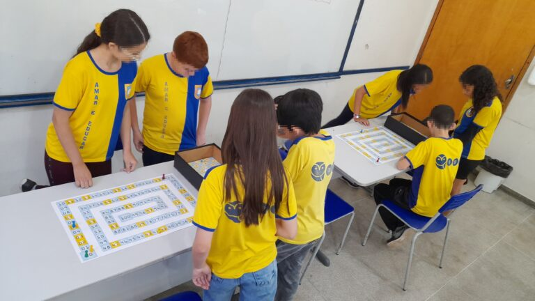
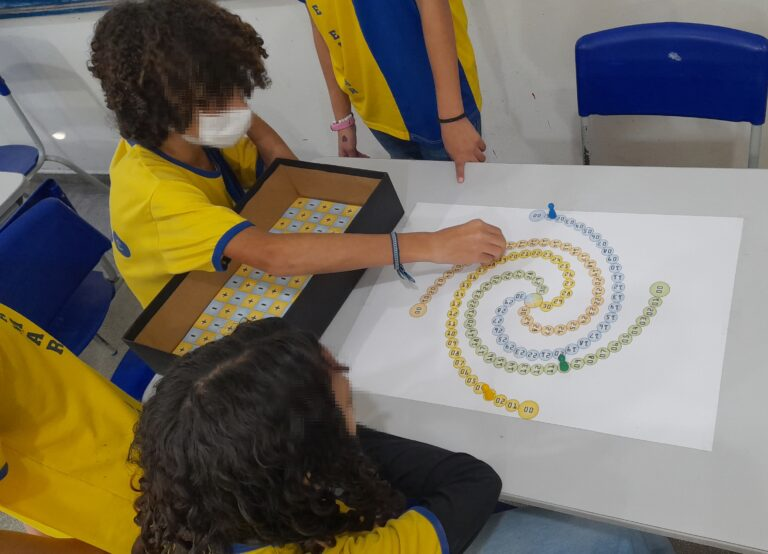

+++
title = "Jogo de tabuleiro para o ensino da Matemática auxilia crianças do Ensino Fundamental a compreender números inteiros" 
subtitle = "Ferramenta proposta por pesquisa desenvolvida na UNIFAL-MG também promove interações sociais entre participantes"
date = "2024-11-19"
#dateFormat = "2006-01-02" # This value can be configured for per-post date formatting
author = ""
authorTwitter = "" #do not include @
cover = "capa_materia_jogo_matematica.jpg"
tags = ["Educação Matemática", "Jogo de Tabuleiro", "Matemática", "PROFMAT", "Projeto +Ciência", "UNIFAL-MG"]
keywords = ["", ""]
description = ""
showFullContent = false
readingTime = false
hideComments = false
+++

A Matemática é uma disciplina básica conhecida por ser difícil, sobretudo durante a infância. Pensando nisso, Luiz Gustavo Alves Silva, orientado, em seu [mestrado](https://www.unifal-mg.edu.br/profmat/), pela professora Cátia Regina de Oliveira Quilles Queiroz, do Departamento de Matemática do [Instituto de Ciências Exatas (ICEx)](https://www.unifal-mg.edu.br/icex/) da UNIFAL-MG, desenvolveu um jogo para o ensino de números inteiros para crianças a partir do 7º ano do Ensino Fundamental.

Denominado “Corrida Zahl”, o jogo foi utilizado junto às crianças do 7º ano da Escola Municipal Benedita Braga Cobra (EMBBC) no município de Borda da Mata/MG em 2023, e se mostrou eficaz, principalmente, em gerar interações sociais entre os participantes. “O jogo cumpriu com as expectativas de ser divertido e interativo, as crianças se ajudavam mutuamente na execução de cálculos, revisão de jogadas e estratégias”, compartilha. “Alunos com maiores dificuldades em Matemática e raciocínio lógico, aos poucos, apresentavam uma maior desenvoltura diante da mediação de outros alunos com maiores habilidades”, completa.

“Alunos com maiores dificuldades em Matemática e raciocínio lógico, aos poucos, apresentavam uma maior desenvoltura diante da mediação de outros alunos com maiores habilidades”, conta Luiz Gustavo Alves Silva, autor da pesquisa. (Foto: Arquivo/Luiz Gustavo Alves Silva)

Segundo o autor da pesquisa, o desenvolvimento do jogo de tabuleiro foi pensado em meio a pandemia de Covid-19, quando ele passava boa parte do tempo de quarentena jogando jogos de tabuleiro em casa com a família. Mas suas regras foram maturadas durante as viagens entre Pouso Alegre, MG e Alfenas, MG, já que ele fazia o trajeto para assistir, semanalmente, às aulas de mestrado. “Foi um ‘tempo vago’ que busquei preencher com ideias para o projeto”, afirma.

Luiz Gustavo Alves Silva – autor da pesquisa desenvolvida junto ao Mestrado Profissional em Matemática em Rede Nacional (PROFMAT) da Universidade. (Foto: Arquivo Pessoal)

O nome está relacionado com a palavra alemã ”Zahl”, o que segundo o autor da pesquisa, é uma referência ao fato do conjunto dos números inteiros ser representado pelo símbolo **ℤ**, que por sua vez, advém da palavra em alemão ‘zahl’, cujo significado é ‘número’. 

A dinâmica do jogo apresenta duas modalidades: adição/subtração e multiplicação/divisão. Para ambas as modalidades, de dois a quatro jogadores competem para avançar em tabuleiros distintos. No jogo de adição e subtração, os participantes começam na casa 0 e se movem até a casa 100, usando dados de operações (D12 para avanço e D6 para retrocesso) para somar ou subtrair números positivos e negativos. Há fichas de fração recebidas ao parar em casas douradas, permitindo lançar um D20 para avançar mais rapidamente. 

No jogo de multiplicação e divisão, o objetivo é chegar à casa central de um tabuleiro com espiral de Fibonacci. Jogadores lançam dois D10 e escolhem multiplicar ou dividir os números sorteados, movendo-se conforme o resultado. Sinais iguais avançam o peão; sinais diferentes o fazem retroceder. A Carta Curinga, obtida em casas douradas, obriga o uso de um dado especial, que decide a operação de forma aleatória, exigindo adaptação estratégica.

Segundo Luiz Gustavo Silva, cada modalidade apresenta uma estratégia própria para ganhar o jogo. “Enquanto que no jogo da adição e subtração, a estratégia encontra-se quase que unicamente na maneira mais eficaz de utilizar as Fichas de Fração, no jogo da multiplicação e divisão, a maior estratégia está em qual operação escolher. Qual das duas operações irá gerar um maior deslocamento? Além disso, deve-se levar em conta se o movimento é de avanço ou de retrocesso”, explica.

Para testar a ferramenta, alguns alunos do 7º ano da EMBBC foram selecionados, por meio de manifestação de interesse e, na sequência, participaram de encontros avaliativos. “O primeiro encontro foi destinado à aplicação de uma avaliação diagnóstica relacionada aos conteúdos abordados no jogo, no segundo foi feita a aplicação do jogo da adição e subtração, no terceiro foi aplicado o jogo da multiplicação e divisão, no quarto encontro foi aplicada uma segunda avaliação sobre resolução de problemas abrangendo os conteúdos trabalhados durante os jogos, já no quinto e último encontro, aplicou-se uma oficina de construção de dados por meio de materiais manipulativos”, detalha.

Embora à primeira vista as regras pareçam complexas, Luiz Gustavo Silva afirma: “As crianças amostradas nesta pesquisa, em geral, compreenderam com grande facilidade as regras e dinâmicas do jogo.”

## Jogos educativos como meio do ensino de matemática

“Corrida Zahl” é uma referência ao fato do conjunto dos números inteiros ser representado pelo símbolo ℤ, que por sua vez, advém da palavra em alemão ‘zahl’, cujo significado é ‘número’. (Foto: Arquivo/Luiz Gustavo Alves Silva)

Para Luiz Gustavo Silva e sua orientadora, a concepção de “Corrida Zahl” e seu uso em escolas para o ensino de números inteiros em Matemática se configura como importante ferramenta, já que a Matemática possui a fama de ser uma matéria difícil. Para eles, as causas dessa dificuldade são multifatoriais e constituem um amplo espaço de investigação em diversas pesquisas acadêmicas. “Os jogos educativos são apontados por estudos e documentos oficiais como a Base Nacional Comum Curricular (BNCC) como alternativas para tornar a Matemática mais atrativa e acessível para as crianças”, enfatiza Luiz Gustavo Silva.

O autor reforça que os jogos educativos no ensino e aprendizagem de Matemática são ferramentas utilizadas há muitos anos, visto que a Matemática formal é baseada em axiomas, definições e proposições rigorosas, conceitos que podem ser demasiadamente abstratos para crianças do Ensino Fundamental. “Os jogos serviriam como ‘pontes’ nesse processo de trazer um conhecimento formal para uma linguagem mais lúdica e acessível a alunos da educação básica”, conta. 

Nesse cenário, também se enquadra o jogo produzido durante a pesquisa, uma vez que, como reforçado por Luiz Gustavo Silva, houve o interesse de elaborar estruturas e materiais de fácil confecção para que qualquer professor de educação básica possa reproduzir o tabuleiro artesanalmente e utilizar com seus alunos, permitindo o uso facilitado da ferramenta.

## Perspectivas futuras da pesquisa

Outras análises, testes e melhoramentos da ferramenta são previstas para a pesquisa, que tem também a perspectiva de ser utilizada com outros públicos, conforme aponta Luiz Gustavo Silva: “Além do estudo de Números Inteiros, o jogo possui suas regras baseadas em conceitos de Análise Combinatória e Probabilidades, ou seja, o jogo também poderia ser trabalhado com alunos do Ensino Médio e gerar resultados igualmente interessantes.”

A pesquisa foi financiada pela [Coordenação de Aperfeiçoamento de Pessoal de Nível Superior (CAPES)](https://www.gov.br/capes/pt-br) com a [defesa de dissertação](https://jornal.unifal-mg.edu.br/mestrado-profissional-em-matematica-realiza-primeira-defesa-tema-do-trabalho-apresentado-envolve-jogos-de-tabuleiro-no-ensino-de-numeros-inteiro/) realizada no Mestrado Profissional em Matemática em Rede Nacional (PROFMAT) no final de 2023.

Para mais informações, acesse a dissertação neste [link](https://profmat-sbm.org.br/dissertacoes/?aluno=Luiz+Gustavo+Alves+Silva&titulo=&polo=)

Conheça também o [Mestrado Profissional em Matemática em Rede Nacional (PROFMAT)](https://www.unifal-mg.edu.br/profmat/) da UNIFAL-MG

*Texto elaborado sob supervisão e orientação de Ana Carolina Araújo, jornalista da Universidade Federal de Alfenas (UNIFAL-MG).*

Visite a [página da UNIFAL-MG](https://jornal.unifal-mg.edu.br/jogo-de-tabuleiro-para-o-ensino-da-matematica/) para acessar o texto na íntegra.