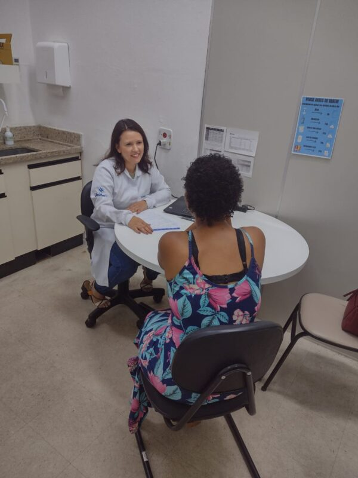
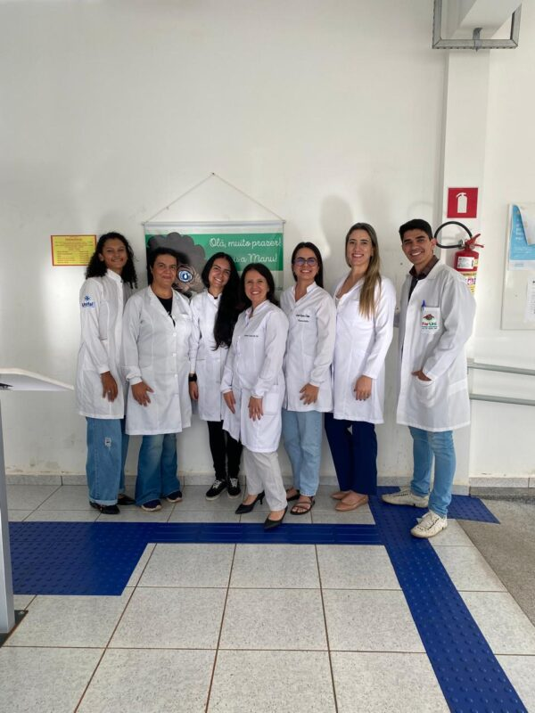
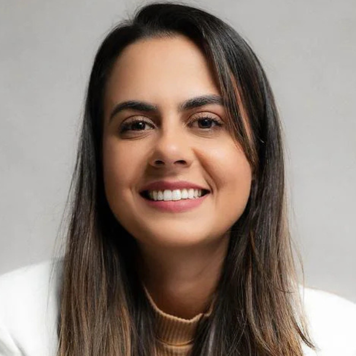
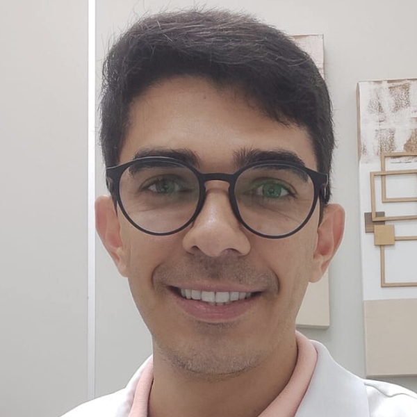
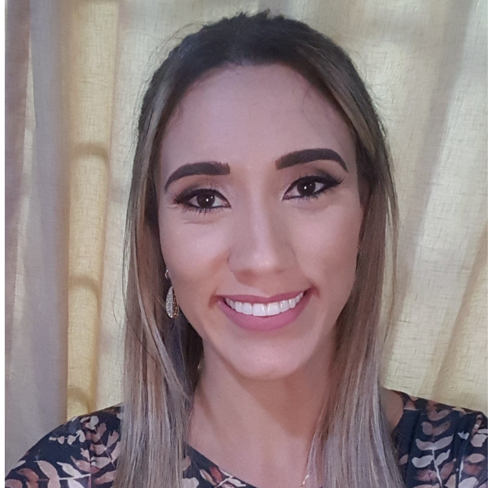
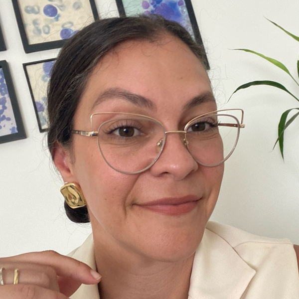
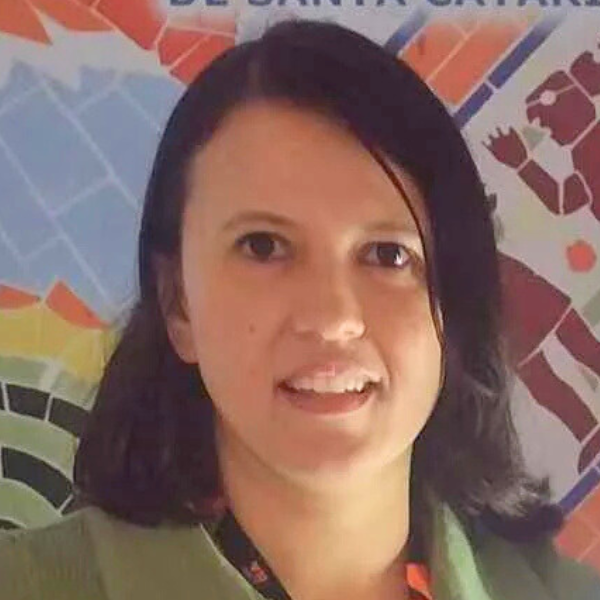
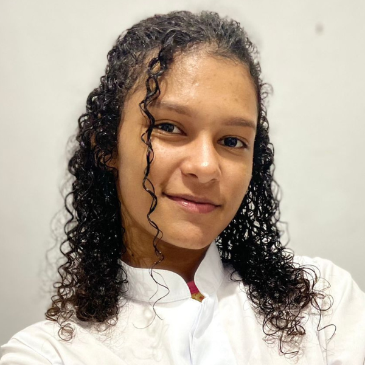
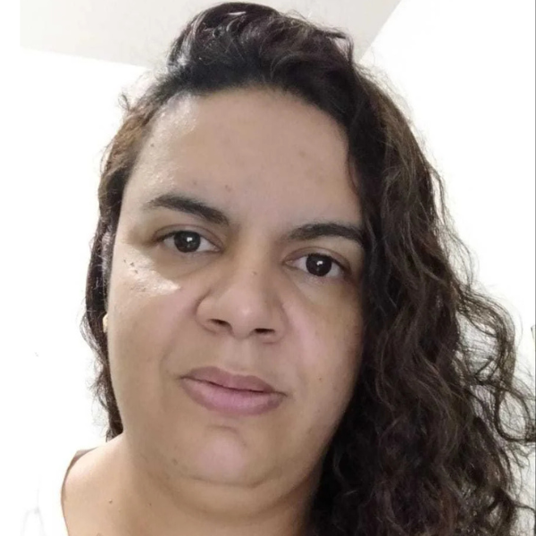
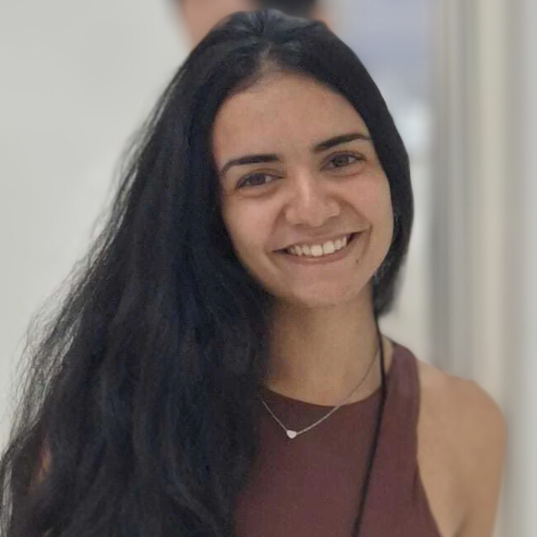

+++
title = "Mais da metade dos usuários do anticoagulante varfarina em Alfenas desconhecem informações básicas sobre o tratamento"
subtitle = "Pesquisa em desenvolvimento no Programa de Pós-Graduação em Assistência Farmacêutica da UNIFAL-MG mostra que cerca de 60% dos pacientes estão fora da faixa terapêutica ideal"
date = "2025-04-08"
#dateFormat = "2006-01-02" # This value can be configured for per-post date formatting
author = ""
authorTwitter = "" #do not include @
cover = "varfarina1.jpg"
#Imagem ilustrativa. (Foto: Reprodução/Canva Education)
tags = ["Anticoagulante", "Pós-graduação em Assistência Farmacêutica", "Varfarina", "Projeto +Ciência", "UNIFAL-MG"]
keywords = ["", ""]
description = ""
showFullContent = false
readingTime = false
hideComments = false
+++

Um estudo realizado no [Programa de Pós-Graduação em Assistência Farmacêutica (PPGASFAR)](https://www.unifal-mg.edu.br/ppgasfar/) da UNIFAL-MG apresenta dados relevantes sobre o perfil de pacientes em uso de varfarina, um anticoagulante amplamente prescrito. A pesquisa, em andamento, indica que mais de 50% dos usuários do medicamento em Alfenas-MG possuem baixo letramento em saúde — o que pode comprometer a segurança e a eficácia do tratamento.

O trabalho é parte da pesquisa de mestrado da acadêmica Camila Campos Dutra, sob a orientação dos professores Tiago Marques dos Reis e Leilismara Sousa Nogueira, ambos da [Faculdade de Ciências Farmacêuticas (FCF)](https://www.unifal-mg.edu.br/fcf/), e considerou os pacientes que fazem uso da varfarina no município de Alfenas, identificados por meio da [Clínica de Especialidades Médicas (CEM)](https://www.unifal-mg.edu.br/faculdadedemedicina/clinica-de-especialidades-medicas-2/), [Farmácia Universitária (FarUni)](https://www.unifal-mg.edu.br/faruni/), [Laboratório Central de Análises Clínicas (LACEN)](https://www.unifal-mg.edu.br/lacen/) e [Secretaria Municipal de Saúde](https://www.instagram.com/secretariasaudealfenas/).

A metodologia da pesquisa incluiu consultas farmacêuticas individuais com abordagem centrada no paciente, coleta de dados sociodemográficos e clínicos, aplicação de instrumentos para medir o nível de letramento e conhecimento dos pacientes sobre o uso da varfarina, bem como testes laboratoriais para avaliar a efetividade e segurança do tratamento.

Registro de atendimento a paciente na Farmácia Universitária. (Foto: Arquivo/Grupo de Pesquisa)

“Cerca de dois terços dos participantes não apresentaram conhecimento satisfatório em anticoagulação e quase 60% deles estavam fora da meta terapêutica definida para a anticoagulação, indicando risco de sangramento e de complicações à saúde dos usuários de varfarina”, detalha o orientador do trabalho, Tiago Reis, sobre os resultados preliminares.

Segundo o pesquisador, o estudo é pioneiro em sua proposta, principalmente por caracterizar os pacientes que fazem uso de varfarina em Alfenas e por analisar como a atuação do farmacêutico pode beneficiar a saúde desses usuários. Para ele, o fato de boa parte dos participantes demonstrarem baixo letramento em saúde e desconhecimento em coagulação reforça o papel estratégico do farmacêutico na gestão da anticoagulação medicamentosa.

“[O estudo] poderá gerar impacto social e econômico ao município e à microrregião em que está alocado, além de contribuir para formação de estudantes de graduação e pós-graduação”, enfatiza. “Isso poderá também corroborar para a visibilidade de nossa Instituição e para o cumprimento de seu papel junto à sociedade enquanto universidade pública”, acrescenta.

Como desdobramento da pesquisa, o grupo planeja a consolidação de um ambulatório clínico para pacientes em uso da varfarina na FarUni da UNIFAL-MG. Para o pesquisador, o principal produto da pesquisa é, não somente avaliar os desfechos vindos desta iniciativa, mas também tornar o serviço sustentável à Instituição e satisfatório à sociedade.

Para 2025, o grupo pretende realizar treinamentos voltados a farmacêuticos, residentes da Residência Multiprofissional em Saúde da Família, estudantes e professores, com o objetivo de preparar a equipe que dará continuidade ao serviço após o encerramento do projeto de pesquisa.

A equipe também já vem promovendo ações de educação em saúde, como rodas de conversa destinadas aos usuários do anticoagulante, conduzidas por estudantes com supervisão dos docentes do projeto.

Parte dos integrantes do grupo de pesquisa. (Foto: Arquivo/Grupo de Pesquisa)

Na nova fase do estudo, que agora avança para o nível de doutorado, o foco será aprofundar a análise dos desfechos clínicos e humanísticos da intervenção. A proposta é avaliar de forma mais ampla os benefícios que a gestão qualificada da anticoagulação, com presença ativa do farmacêutico, pode oferecer aos pacientes.

O estudo está vinculado ao [Grupo de Pesquisa em Assistência Farmacêutica](https://www.unifal-mg.edu.br/gpaf/#:~:text=O%20Grupo%20de%20Pesquisa%20em,na%20%C3%A1rea%20do%20Cuidado%20Farmac%C3%AAutico.) e constitui parte de um projeto mais amplo, intitulado Projeto FLUIR: Manejo e cuidado do paciente em anticoagulação, coordenado pelos orientadores da pesquisa. Tal pesquisa recebeu financiamento da [Fundação de Amparo à Pesquisa do Estado de Minas Gerais (FAPEMIG)](https://fapemig.br/).

Conheça os pesquisadores do grupo:

Camila Campos Dutra – acadêmica do mestrado em Assistência Farmacêutica

Tiago Marques dos Reis – professor e orientador do estudo

Leilismara Sousa Nogueira – professora e coorientadora do estudo

Iara Baldim Rabelo Gomes – professora e médica

Josiane Costa de Sá – acadêmica

Karen Cristina Cássia Roesler da Silva – acadêmica

Márcia Viviane dos Santos – acadêmica

Yasmin dos Santos Lousano – acadêmica

*Texto elaborado sob supervisão e orientação de Ana Carolina Araújo, jornalista da Universidade Federal de Alfenas (UNIFAL-MG).*

Visite a [página da UNIFAL-MG](https://jornal.unifal-mg.edu.br/116639-2/) para acessar o texto na íntegra.
