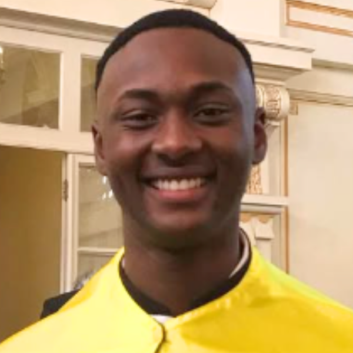
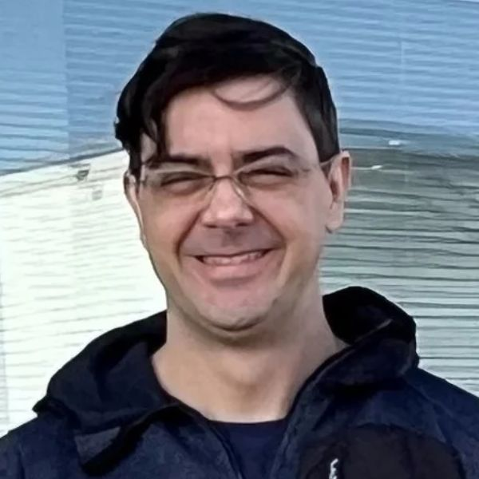
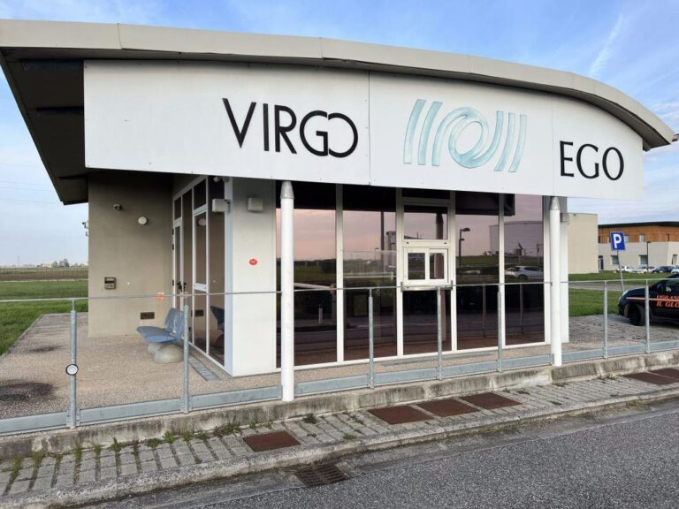
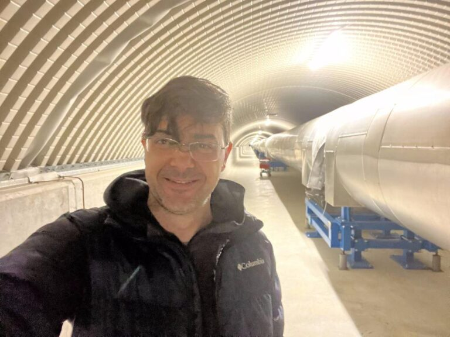

+++
title = "Estudo usa conceitos de física básica para explicar buracos negros e ondas gravitacionais"
subtitle = "Pesquisa da UNIFAL-MG transforma conceitos avançados em aprendizado acessível para estudantes da área de Ciências Exatas"
date = "2025-07-08"
#dateFormat = "2006-01-02" # This value can be configured for per-post date formatting
author = ""
authorTwitter = "" #do not include @
cover = "buraco-negro.jpg"
#Imagem ilustrativa. (Foto: Reprodução/Canva Education)
tags = ["Astrofísica", "Buraco Negro", "Física", "Ondas Gravitacionais", "Programa de Pós-Graduação em Física", "Projeto +Ciência", "UNIFAL-MG"]
keywords = ["", ""]
description = ""
showFullContent = false
readingTime = false
hideComments = false
+++

Com o intuito de possibilitar que o estudo de ondas gravitacionais e buracos negros sejam mais acessíveis para alunos no início de graduação em cursos da área de Ciências Exatas, pesquisadores da UNIFAL-MG desenvolveram métodos, utilizando conceitos e equações de física básica, para facilitar os cálculos e entendimentos. A pesquisa foi desenvolvida em 2022 como um projeto de iniciação científica do discente do curso de Física Nicolas Lerioni Nascimento e orientado pelo professor Rodrigo Cuzinatto, do [Programa de Pós-Graduação em Física](https://www.unifal-mg.edu.br/ppgf/) da UNIFAL-MG.

Nicolas Nascimento – egresso de Física e autor do estudo. (Foto: Arquivo Pessoal)

Rodrigo Cuzinatto – professor e orientador. (Foto: Arquivo Pessoal)

Para o orientador, o principal mérito do trabalho é o caráter pedagógico. “Ele entrega ideias e resultados sofisticados de uma forma supostamente tão simples quanto possível”, destaca. O professor acrescenta que as equações estipuladas permitiram estimar com precisão os parâmetros físicos de sistemas binários de buracos negros em comparação com os dados coletados pela colaboração da rede internacional dos observatórios e interferômetros [LIGO-Virgo-Kagra (LVK)](https://gcn-nasa-gov.translate.goog/missions/lvk?_x_tr_sl=en&_x_tr_tl=pt&_x_tr_hl=pt&_x_tr_pto=tc).

Segundo ele, o artigo produzido trata do tema das ondas gravitacionais com um nível de exigência técnica adequado à etapa de formação de alunos de cursos de Ciências Exatas em início de graduação.

## Entendendo a gravidade de forma didática

Para explicar os conceitos da relatividade de Einstein, Rodrigo Cuzinatto utilizou uma analogia visual: “Podemos imaginar o espaço como um lençol esticado, bem lisinho e plano, segurado por quatro pessoas em cada uma de suas pontas. Uma quinta pessoa coloca uma bola de boliche no centro do lençol. Isso provocaria o aparecimento de uma bacia no lençol. Se jogássemos uma bola de tênis sobre esse lençol, ela seguiria uma trajetória curva devido à bacia produzida pela bola de boliche no lençol.” Nessa metáfora, a bola de boliche representa a Terra, e a bola de tênis, a Lua.

Segundo ele, Einstein sugeriu que a gravitação não é uma força atrativa, como defendia Newton, mas sim, uma curvatura do espaço e tempo, produzida pela presença de matéria. O professor explicou que são ondas gravitacionais, ao comparar as perturbações de um corpo massivo no tecido do espaço-tempo, com uma pedra jogada no lago. “Sabemos o que são ondas na superfície de um lago calmo perturbada pela queda de uma pedrinha. De forma parecida, ondas gravitacionais são perturbações no tecido do espaço e do tempo, provocadas pelo movimento de grandes corpos, como buracos negros”, esclarece.

## Contribuição científica e oportunidades para estudantes

Conforme o professor, além de tornar mais acessível o conteúdo científico, o trabalho produzido também aborda como as ondas gravitacionais são detectadas e como colisões de buracos negros e estrelas de nêutrons confirmam as previsões da teoria da relatividade.

Rodrigo Cuzinatto aponta que toda a comunidade se beneficia com o desenvolvimento da economia movimentada para sustentar os laboratórios, o desenvolvimento de indústrias – de precisão e da engenharia de instrumentação, inclusive as brasileiras. Além disso, os estudantes podem se beneficiar com bolsas de estudo nas universidades envolvidas na colaboração LVK.

Virgo é o nome do detector de ondas gravitacionais localizado na cidade de Pisa, na Itália. (Foto: Arquivo/Rodrigo Cuzinatto)

A expectativa dos autores é estimular mais estudantes interessados na física do espaço a direcionarem suas escolhas acadêmicas para o estudo de ondas gravitacionais.

“Os estudantes da UNIFAL-MG estão convidados a trabalhar na colaboração LVK através do grupo VirgoBR. Há oportunidades para IC [iniciação científica] e mestrado conosco; há também possibilidade de doutoramento nas demais instituições com período de experiência no exterior”, frisa o professor Rodrigo Cuzinatto.

Rodrigo Cuzinatto integra o grupo de pesquisa do Observatório VirgoBR, vinculado à colaboração internacional LIGO-Virgo-Kagra (LVK). (Foto: Arquivo Pessoal)

O projeto foi financiado pelo [Conselho Nacional de Desenvolvimento Científico e Tecnológico (CNPq)](https://www.gov.br/cnpq/pt-br), por meio do Programa Institucional de Bolsas de Iniciação Científica (PIBIC) da UNIFAL-MG. O trabalho foi selecionado pela [Pró-Reitoria de Pesquisa e Pós-Graduação (PRPPG)](https://www.unifal-mg.edu.br/prppg/) para competir nacionalmente pelo prêmio CNPq de melhor iniciação científica em 2022.

Para informações adicionais sobre o grupo VirgoBR, [acesse aqui](https://www.instagram.com/virgobrasil/).

Para a leitura do artigo na íntegra, clique [neste link](https://www.scielo.br/j/rbef/a/Rk3M8xjnHxGZVjVZSjPbDkt/?lang=pt).

*Texto elaborado sob supervisão e orientação de Ana Carolina Araújo, jornalista da Universidade Federal de Alfenas (UNIFAL-MG).*

Visite a [página da UNIFAL-MG](https://jornal.unifal-mg.edu.br/estudo-usa-conceitos-de-fisica-basica-para-explicar-buracos-negros-e-ondas-gravitacionais/) para acessar o texto na íntegra.