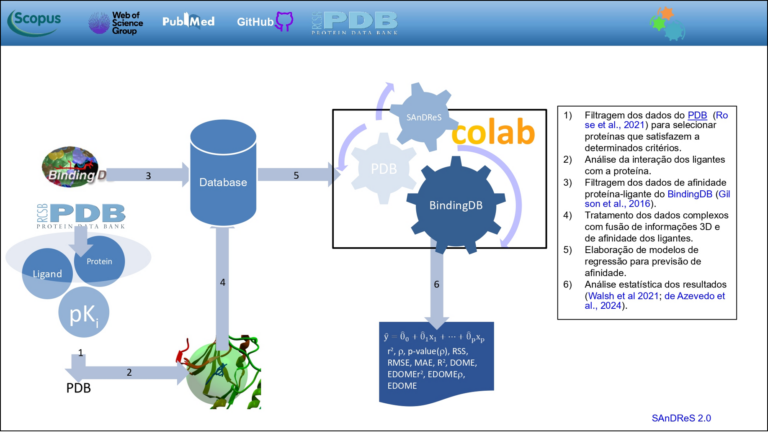

+++
title = "Ferramenta computacional otimiza o desenvolvimento de novos fármacos em estudos de doenças como o câncer com a ajuda de IA"
subtitle = "Com o uso da plataforma SAnDReS, equipe de pesquisadores da UNIFAL-MG identifica compostos com potencial terapêutico de forma mais rápida e precisa"
date = "2025-08-07"
author = "Rafael Martins da Silva Afeto"
cover = "docking-farmaco.jpg"
tags = ["Física", "Inteligência Artificial", "PPGF", "SAnDReS", "Projeto +Ciência", "UNIFAL-MG"]
categories = ["Saúde", "Tecnologia"]
keywords = ["inteligência artificial fármacos", "SAnDReS docking molecular", "desenvolvimento de medicamentos IA", "proteína CDK2 câncer", "aprendizado de máquina fármacos"]
description = "Equipe da UNIFAL-MG usa a ferramenta de IA SAnDReS para modelar interações moleculares e acelerar a identificação de potenciais fármacos contra o câncer."
showFullContent = false
readingTime = false
hideComments = false
+++
Uma equipe de pesquisadores vinculada aos programas de pós-graduação em [Biotecnologia](https://www.unifal-mg.edu.br/ppgbiotec/) e em [Física](https://www.unifal-mg.edu.br/ppgf/) da UNIFAL-MG utilizou uma ferramenta de IA, chamada SAnDRes, para modelar interações entre a proteína CDK2 (alvo terapêutico no combate ao câncer) e os inibidores, a fim de identificar fármacos em potencial de forma mais rápida e precisa. A pesquisa foi conduzida pelo pesquisador Walter Filgueira de Azevedo Júnior, professor visitante do Programa de Pós-Graduação em Física (PPGF).

Walter Azevedo Júnior – professor visitante do Programa de Pós-Graduação em Física foi quem conduziu a pesquisa. (Foto: Arquivo/Dicom)

Segundo o pesquisador, por meio do SAnDReS foi possível simular o encaixe de inibidores na proteína CDK2 e prever quais moléculas têm chance real de funcionar como fármacos. “Eu resolvi a estrutura dessa proteína com inibidores encaixados nela”, conta Walter Azevedo Júnior. O pesquisador afirma que a informação traz um instante “congelado” com a proteína e o fármaco, tal como fechadura e chave. “Esses dados são tabelados e usados como entrada para criarmos um modelo de aprendizado de máquina”, acrescenta.

A metodologia combina duas tecnologias. Primeiro, a simulação de docking, que é um sistema capaz de testar moléculas que se ligam a essa proteína-alvo. Segundo, o aprendizado de máquina, o qual melhora a previsão ao identificar padrões nos dados. Juntas, essas tecnologias geram uma espécie de pontuação – função escore, que calcula de que forma a molécula se encaixa.

O pesquisador pontua que o uso da abordagem computacional com inteligência artificial permite filtrar as moléculas com maior chance de sucesso. A técnica também contribui para que os pesquisadores concentrem os testes experimentais e clínicos apenas naquelas que já demonstraram bom desempenho nas simulações virtuais. “Todas as fases experimentais e clínicas são otimizadas com o uso da abordagem computacional. Ao invés de testarmos clinicamente milhares de moléculas, testamos somente aquelas que passaram no teste computacional”, argumenta.

Para obter melhores resultados, o pesquisador reforça que os modelos de IA precisam ser treinados especificamente para cada proteína-alvo. “Na nossa experiência e de outros grupos de pesquisa desenvolvendo funções escores ficou claro que aquelas funções ‘treinadas’ para uma proteína específica funcionam melhor que as funções escores universais, que tentam determinar o encaixe para todas as proteínas”, compartilha.

O fluxograma esquemático indica os passos seguidos no uso de big data para a construção de modelos para previsão de inibição de proteínas. (Imagem: Reprodução/SAnDRes)

Conforme Walter Azevedo Júnior, o objetivo da pesquisa e do SAnDReS é possibilitar que a comunidade científica tenha acesso a ferramentas como essas, em especial, os grupos voltados a testes de fármacos. O programa SAnDReS é disponibilizado como software livre (open source), o que permite seu uso gratuito em outras pesquisas. Atualmente, seu grupo está ampliando os métodos e as variáveis utilizadas para acrescentar no modelo.

O projeto de pesquisa é financiado pelo [Conselho Nacional de Desenvolvimento Científico e Tecnológico (CNPq)](https://www.gov.br/cnpq/pt-br).

A ferramenta SAnDReS pode ser acessada [neste link](https://github.com/azevedolab/sandres). Na página Wiki também pode ser encontrada a [descrição resumida](https://github.com/azevedolab/sandres/wiki/SAnDReS) do programa (em inglês).

Para mais informações sobre as pesquisas e projetos do professor Walter Azevedo Júnior, acesse aqui.

Leia também: [Grupo internacional de pesquisadores liderados pela UNIFAL-MG desenvolve programa de Inteligência Artificial para previsão de ação de fármacos](https://jornal.unifal-mg.edu.br/grupo-internacional-de-pesquisadores-liderados-pela-unifal-mg-desenvolve-programa-de-inteligencia-artificial-para-previsao-de-acao-de-farmacos/)

*Texto elaborado sob supervisão e orientação de Ana Carolina Araújo, jornalista da Universidade Federal de Alfenas (UNIFAL-MG).*

Visite a [página da UNIFAL-MG](https://jornal.unifal-mg.edu.br/plataforma-sandres-otimiza-a-identificacao-de-compostos-novos-farmacos/) para acessar o texto na íntegra.
