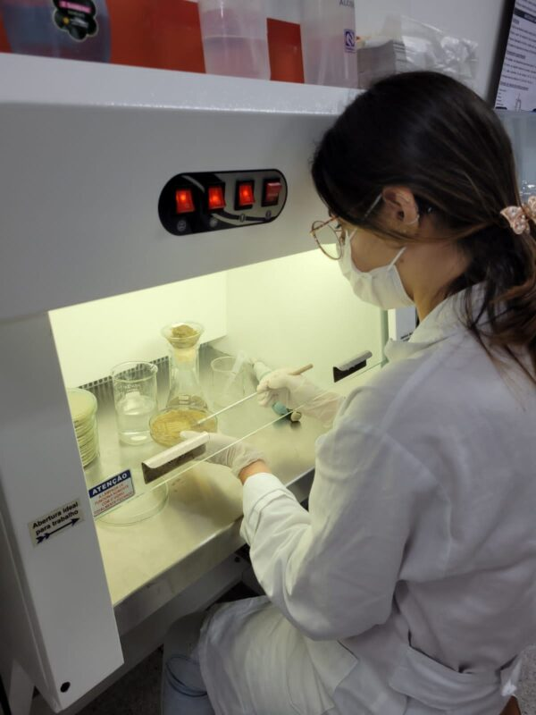
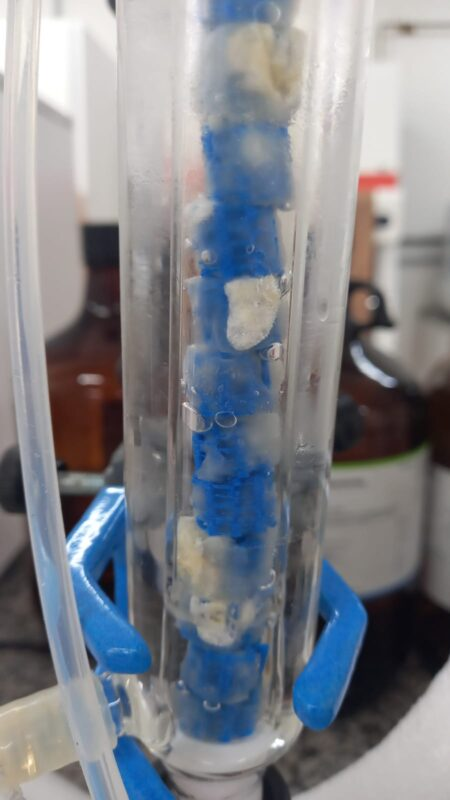
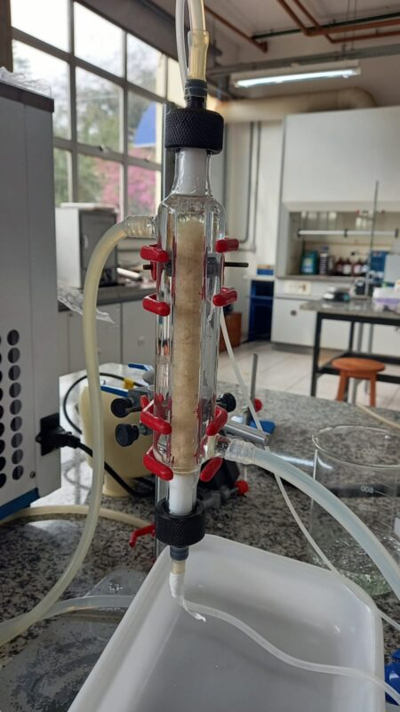
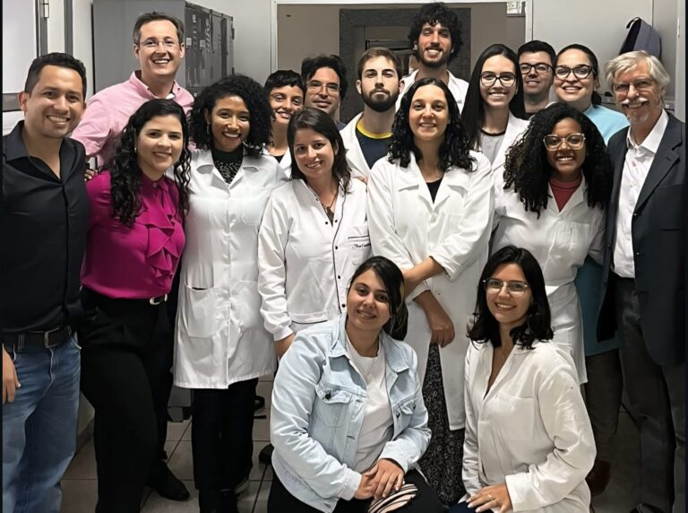

+++
title = "Grupo de pesquisa desenvolve tecnologia nacional inédita que promete popularizar o ‘açúcar do bem’"
subtitle = "Pesquisadores da UNIFAL-MG e de instituições parceiras criam método inovador para produzir fruto-oligossacarídeos (FOS) a partir da sacarose da cana-de-açúcar, o que reduz custos e diminui a dependência de importações"
date = "2025-09-03"
#dateFormat = "2006-01-02" # This value can be configured for per-post date formatting
author = ""
authorTwitter = "" #do not include @
cover = "capa_pesquisa_acucar-do-bem.jpg"
#PLA [Poliácido Láctico - tipo plástico biodegradável] impresso em 3d para imobilização das células fúngicas. (Foto: Arquivo/Grupo de pesquisa)
tags = ["FAPEMIG", "Açúcar do bem", "PPGEQ", "Biotecnologia", "CNPq", "Projeto +Ciência", "UNIFAL-MG"]
keywords = ["", ""]
description = ""
showFullContent = false
readingTime = false
hideComments = false
+++

Um grupo de pesquisa UNIFAL-MG, vinculado ao [Programa de Pós-Graduação em Engenharia Química](https://www.unifal-mg.edu.br/ppgeq/) e com a colaboração de instituições parceiras, está perto de mudar o cenário da produção de fruto-oligossacarídeos (FOS), conhecidos como o ‘açúcar do bem’. Hoje 100% importado, esse tipo especial de açúcar pode, em breve, ser produzido no Brasil a preços mais acessíveis a toda população.

Segundo os pesquisadores, os FOS são açúcares com propriedades funcionais: têm baixo valor calórico, são indicados para diabéticos, não causam cáries e atuam como prebióticos, servindo de alimento para as bactérias benéficas do intestino humano. Além disso, estudos apontam efeitos positivos na prevenção do câncer de cólon e no tratamento de doenças como anemia e hipertensão.

“Queremos colocar no mercado um açúcar de baixo custo, competitivo e que possa atender principalmente pessoas com doenças metabólicas, como o diabetes”, explica o professor Rafael Firmani Perna, líder do grupo de pesquisa e coordenador do [Laboratório de Tecnologia Enzimática e Bioprocessos](https://www.unifal-mg.edu.br/ppgbiotec/lab-de-tecnologia-enzimatica/) da UNIFAL-MG.

Rafael Firmani Perna – professor da UNIFAL-MG e líder do grupo de pesquisa. (Foto: Arquivo Pessoal)

Para os autores, apesar dos benefícios, o Brasil não produz FOS. Todo o consumo nacional depende de importações, o que encarece o produto e restringe sua presença no mercado. O preço atual é de cerca de US$ 165 por quilo, inacessível para a maioria da população. O cenário global, no entanto, mostra um mercado em expansão: em 2024, o setor movimentou US$ 3,85 bilhões e deve chegar a US$ 6,25 bilhões até 2029, com taxa de crescimento anual de 10,19%.

## A inovação brasileira

O grupo apostou em duas frentes para viabilizar a produção nacional: usar a sacarose, oriunda da cana-de-açúcar, como matéria-prima – abundante e barata no país – e adotar um processo contínuo com reatores de leito fixo (PBR).

Para converter a sacarose em FOS, foi necessário um biocatalisador específico: uma enzima produzida pelo fungo Aspergillus oryzae IPT-301. “Esse fungo é o único capaz de produzir a enzima adequada para transformar, potencialmente, a sacarose em FOS”, detalha o professor Rafael Perna.

Pesquisadora cultivando o fungo. (Foto: Arquivo/Grupo de pesquisa)

O desafio seguinte foi tornar as células mais resistentes no processo produtivo. A solução veio com a engenharia de bioprocessos: os cientistas usaram poliácido lático (PLA), um plástico biodegradável e reciclável, para criar estruturas 3D que imobilizam os micro-organismos. Isso aumentou a estabilidade operacional das células e garantiu uma produção mais eficiente e sustentável do açúcar prebiótico. Segundo o professor, o grupo já alcançou uma produção de aproximadamente 160 g/L.h de FOS em escala laboratorial, um resultado promissor que foi validado por estudos de viabilidade técnico-econômica realizados pelo grupo de pesquisa.

Início da reação utilizando o impresso 3d de PLA em reator de leito fixo. (Arquivo/Grupo de pesquisa)

Reator de leito fixo. (Arquivo/Grupo de pesquisa)

## Próximos passos

O grupo já alcançou a produção de FOS em solução e agora avança nas etapas de recuperação e purificação do bioproduto, visando atender tanto à indústria alimentícia quanto à farmacêutica. A expectativa é que o ‘açúcar do bem’ nacional esteja disponível no mercado em até oito anos. “A equipe está totalmente focada no desenvolvimento das etapas de recuperação e purificação do FOS, que são fundamentais para o processo, representando até 70% dos custos de produção do açúcar prebiótico”, afirma o pesquisador.

E a pesquisa não deve parar por aí. Segundo Rafael Perna, a mesma tecnologia poderá ser aplicada na produção de outros compostos de alto valor agregado, como ésteres de açúcares, usados em cosméticos para tratamentos dermatológicos.

## Colaborações nacionais e internacionais e apoio financeiro

A rede de pesquisa conta com parcerias nacionais e internacionais, incluindo laboratórios da Universidade Federal do Tocantis (UFT, Campus Palmas-TO), da Universidade Estadual Paulista (UNESP, Campus São Vicente-SP), do Instituto de Pesquisas Tecnológicas de São Paulo (IPT, São Paulo-SP) e do Centro de Engenharia Biológica da Universidade do Minho, em Portugal.

Parte dos pesquisadores que fazem parte da rede de colaboração. (Foto: Arquivo/Grupo de pesquisa)

Nos últimos anos, o trabalho foi apoiado por oito projetos financiados pela [Fundação de Amparo à Pesquisa do Estado de Minas Gerais – FAPEMIG](https://fapemig.br/) (Processos APQ-00793-24, BPD-00030-22, APQ-00085-21 e APQ-02131-14) e pelo [Conselho Nacional de Desenvolvimento Científico e Tecnológico (CNPq)](https://www.gov.br/cnpq/pt-br) do Governo Federal (Processos 305029/2024-0, 408302/2023-2, 404912/2021-4 e 421540/2018-4).

Para mais informações sobre o projeto, acesse o Instagram do Laboratório de Tecnologia Enzimática e Bioprocessos da UNIFAL-MG [neste link](https://www.instagram.com/labtech.teb/?igsh=MWt3cGwzcWJtOG5pbw%3D%3D).

Confira também informações sobre os laboratórios parceiros: [Laboratório Micobio-Nanotec – UNESP/Campus São Vicente-SP](https://www.instagram.com/micobionanotec/?igsh=aGtkaTk5cjI4eDVp) e [Laboratório de Instrumentação Científica – UFT/Campus Palmas-TO](https://www.instagram.com/labic.uft/?igsh=YXk5ZjMwejJqOWtz)

*Texto elaborado sob supervisão e orientação de Ana Carolina Araújo, jornalista da Universidade Federal de Alfenas (UNIFAL-MG).*

Visite a [página da UNIFAL-MG](https://jornal.unifal-mg.edu.br/grupo-de-pesquisa-desenvolve-tecnologia-nacional-inedita-que-promete-popularizar-o-acucar-do-bem/) para acessar o texto na íntegra.