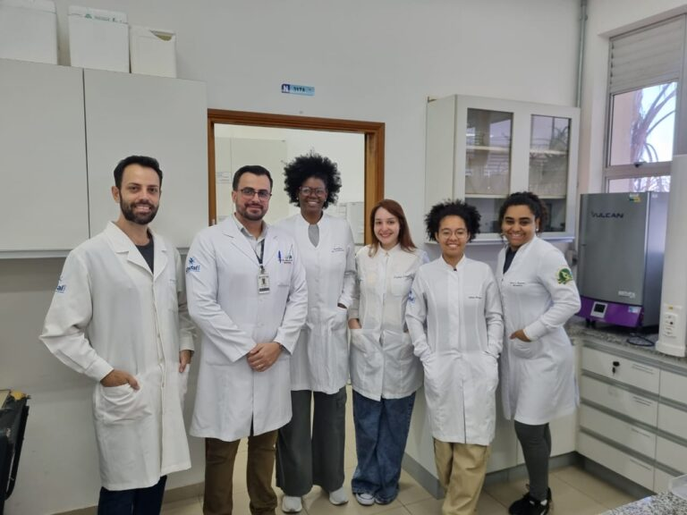

+++
title = "Compostos naturais da soja apresentam efeitos benéficos para doença muscular genética, aponta estudo"
subtitle = "Utilizando modelo experimental, grupo de pesquisa liderado por professor da UNIFAL-MG demonstra potencial ação antioxidante e anti-inflamatória de compostos naturais derivados da soja para distrofia muscular de Duchenne"
date = "2025-09-15"
author = "Rafael Martins da Silva Afeto"
cover = "capa_pesquisa_extrato-soja-distrofia.jpg"
tags = ["Anatomia", "Bioestrutura Neuromuscular", "Distrofia Muscular de Duchenne", "Extrato de Soja", "Isoflavonas", "Projeto +Ciência", "UNIFAL-MG"]
categories = ["Saúde"]
keywords = ["distrofia muscular de Duchenne", "isoflavonas soja", "tratamento DMD", "extrato de soja saúde muscular", "pesquisa neuromuscular UNIFAL"]
description = "Estudo da UNIFAL-MG mostra que isoflavonas da soja melhoram a função muscular e reduzem inflamação em modelo experimental de distrofia muscular de Duchenne."
showFullContent = false
readingTime = false
hideComments = false
+++

A distrofia muscular de Duchenne (DMD) é uma doença genética grave que causa perda muscular progressiva e fraqueza que afeta principalmente os meninos, mas pesquisadores da UNIFAL-MG podem ter dado um passo na identificação de possíveis compostos que auxiliam no tratamento dessa doença. Trata-se das isoflavonas: substâncias presentes no extrato de soja, consideradas estrogênios naturais.

Ao investigar a ação protetora das isoflavonas no tecido muscular em modelo experimental com camundongos mdx, o Grupo de Pesquisa em Bioestrutura Neuromuscular (GPBioNM), liderado por Túlio de Almeida Hermes, professor e pesquisador do Departamento de Anatomia do [Instituto de Ciências Biomédicas](https://www.unifal-mg.edu.br/icb/) da UNIFAL-MG, observou melhora na função muscular, redução da necrose e dos marcadores inflamatórios e oxidativos.

Túlio de Almeida Hermes professor e pesquisador do Departamento de Anatomia, líder do Grupo de Pesquisa em Bioestrutura Neuromuscular. (Foto: Arquivo Pessoal)

“Com os resultados da pesquisa, podemos determinar isoflavonas potencialmente mais ativas e investigar seu efeito na DMD de modo isolado”, aponta o pesquisador.

De acordo com ele, a distrofia muscular de Duchenne é causada por uma mutação no gene DMD, que leva à falta da proteína distrofina, responsável pela estabilidade na célula muscular. “Sem essa proteína, o músculo pode sofrer algumas lesões, que são verdadeiras rupturas na membrana, levando assim, a entrada exa
gerada de cálcio que em altas concentrações é tóxico”, explica.

Atualmente, a doença não possui uma cura e o tratamento é pelo uso de glicocorticóides, que melhoram a condição geral do paciente, mas causam muitos efeitos colaterais.

A pesquisa realizada pelo grupo, segundo o professor Túlio Hermes, ainda não gerou um tratamento. “Por hora é objeto de investigação e a possibilidade de encontrar potenciais isoflavonas com grande potencial terapêutico no extrato é bastante estimulante”, observa.

Integrantes do Grupo de Pesquisa em Bioestrutura Neuromuscular com o professor Túlio Hermes. (Foto: Arquivo/Túlio Hermes)

Mas os pesquisadores identificaram que o extrato da soja, além de ser uma alternativa vantajosa para um potencial tratamento, devido ao custo baixo e maior acessibilidade da soja, também foi seguro para os camundongos, não gerando toxicidade para os rins e fígado do animal.

Para Túlio Hermes, isso é só o começo. “Este trabalho possibilitou propor um novo estudo, que se encontra em fase inicial, sobre a investigação dos mecanismos moleculares e celulares do uso de uma das classes das isoflavonas determinadas no estudo anterior”, conta.

A pesquisa, vinculada ao projeto CNPq 402493/2021-4, foi financiada pelo [Conselho Nacional de Desenvolvimento Científico e Tecnológico (CNPq)](https://www.gov.br/cnpq/pt-br) e logo estará publicada com acesso aberto à comunidade.

*Texto elaborado sob supervisão e orientação de Ana Carolina Araújo, jornalista da Universidade Federal de Alfenas (UNIFAL-MG).*

Visite a [página da UNIFAL-MG](https://jornal.unifal-mg.edu.br/compostos-naturais-da-soja-apresentam-efeitos-beneficos-para-doenca-muscular-genetica-aponta-estudo/) para acessar o texto na íntegra.
