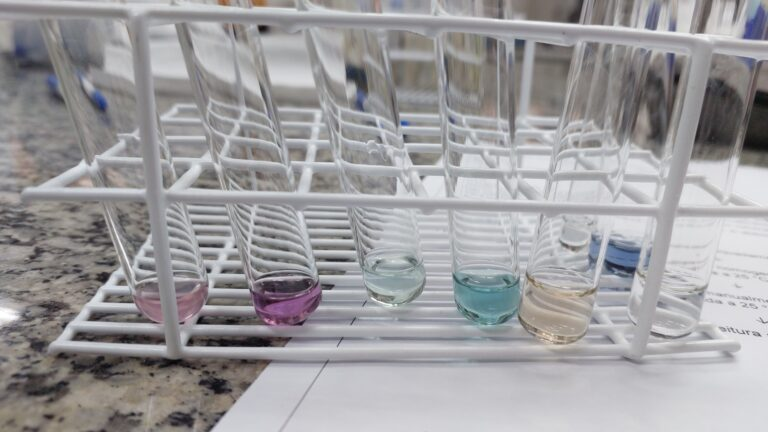
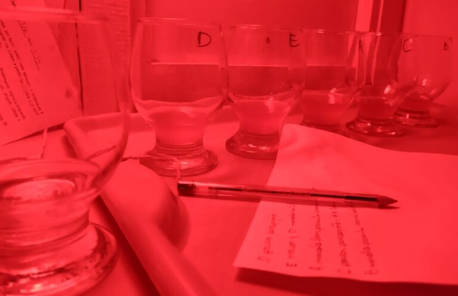
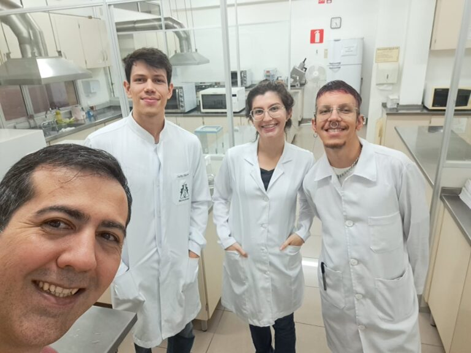

+++
title = "Pesquisadores confirmam potencial antioxidante na produção de cerveja com marolo e sabor é aprovado por avaliadores"
subtitle = "Resultados de estudo de iniciação científica da UNIFAL-MG reforçam o valor agregado das cervejas com frutas"
date = "2025-01-30"
#dateFormat = "2006-01-02" # This value can be configured for per-post date formatting
author = ""
authorTwitter = "" #do not include @
cover = "capa_pesquisa-cerveja-com-marolo.jpg"
#Tallis Vinicius Araujo da Silva, discente do curso de Biotecnologia, durante a primeira fase da pesquisa. (Foto: Arquivo Pessoal)
tags = ["Cerveja com Ciência", "Cerveja com Marolo", "Ciência da Cerveja", "Marolo", "Pesquisa", "Projeto +Ciência", "UNIFAL-MG"]
keywords = ["", ""]
description = ""
showFullContent = false
readingTime = false
hideComments = false
+++
Pesquisadores da UNIFAL-MG, vinculados ao projeto [Cerveja com Ciência](https://www.unifal-mg.edu.br/lme/cervejacomciencia/), produziram cerveja com marolo e testaram o seu potencial antioxidante utilizando diferentes concentrações da fruta. O resultado mostrou que a cerveja com marolo tem maior potencial oxidante e o sabor foi aprovado pelos avaliadores.

A pesquisa integra o projeto de iniciação científica realizado por Tallis Vinicius Araujo da Silva, discente do curso de Biotecnologia, sob orientação dos professores Gabriel Gerber Hornink, do Instituto de Ciências Biomédicas (ICB), e Bruno Martins Dala Paula, da Faculdade de Nutrição (FANUT), com auxílio de colegas graduandos dos cursos de Biotecnologia e de Ciências Biológicas.

O marolo foi inserido em diferentes concentrações e em dois momentos durante a produção da cerveja: na fermentação e na maturação. (Foto: Arquivo/Tallis Silva)

Segundo explica o acadêmico, a fruta foi inserida em diferentes concentrações e em dois momentos: na fermentação e na maturação. “Produziu-se cerveja com marolo na maturação que apresentou maior potencial antioxidante e maior preferência com relação aos outros tratamentos – sem marolo e marolo na fermentação”, relata Tallis Silva. “Além disso, os avaliadores não souberam diferenciar as variações na concentração de marolo dos tratamentos, habilitando o uso dos tratamentos que tem maior concentração da fruta para o painel treinado, visto que possuem maior potencial antioxidante e são estatisticamente iguais aos outros, no parâmetro sensorial”, acrescenta.

Registro feito durante a análise sensorial. (Foto: Arquivo/Tallis Silva)

A avaliação foi realizada em dois momentos: no primeiro, um grupo de 17 avaliadores treinados fez uma análise sensorial das cervejas, classificando-as conforme a intensidade do sabor do marolo. Esses avaliadores, que foram testados quanto à sensibilidade para identificar diferentes sabores, também indicaram as cervejas que mais gostaram. As amostras mais promissoras seguiram para a próxima fase. Já o segundo momento foi o teste de preferência (painel não treinado), em que 84 avaliadores indicaram qual tratamento foi o seu preferido e o quanto gostou de cada amostra.

Mas a ingestão de cervejas ainda apresenta riscos, conforme destaca o autor. “A cerveja com marolo, mesmo com maior potencial antioxidante comparada com a sem marolo, sendo uma bebida alcoólica, apresenta etanol e a ingestão deste, principalmente de forma não moderada, pode contribuir para o aparecimento de várias doenças”, alerta.

Para testar o marolo, Tallis Silva utilizou uma inovação tecnológica chamada pico-fermentadores. “Os pico-fermentadores são adaptações com tubos falcons para fermentação em escala laboratorial, que poderão ser aplicados em diversas áreas e contribuir com as cervejarias em seus testes de qualidade ou de novos produtos”, explica.  e: “Uma vez que validamos esse sistema de fermentadores para escala laboratorial, estamos com novos experimentos avaliando outros parâmetros da fermentação utilizando-se desse sistema”, ressalta o pesquisador sobre a contribuição da tecnologia.

O estudo cervejeiro na Universidade já era presente com a atuação do professor Gabriel Hornink, que coordena o projeto “Ciência da cerveja: estudo da influência de variáveis na fermentação no desempenho fermentativo e potencial antioxidante de cervejas”, enquanto que as propriedades do marolo já vem sendo estudadas pelo professor Bruno Dala Paula.

À esquerda o professor Gabriel Hornink, acompanhado por Tallis Silva e colegas da equipe do projeto. (Foto: Arquivo/Tallis Silva)

De acordo com Tallis Silva, a parceria entre os professores provou a ideia de testar a inserção do marolo na cerveja, devido à escassez de pesquisas na área e ao potencial econômico da fruta regional, visto que é uma fruta endêmica do sul-mineiro e com produção cultural de cerveja com o insumo, que pode agregar valor às cervejas com frutas.

A pesquisa recebeu apoio por meio do Programa Institucional de Bolsas de Iniciação Científica e Tecnológica – PIBICT/FAPEMIG.

O resumo do trabalho, apresentado durante o 10º Simpósio Integrado da UNIFAL-MG, pode ser [acessado neste no jornal da UNIFAL](https://jornal.unifal-mg.edu.br/wp-content/uploads/2025/01/Aumento-de-valor-agregado-da-cerveja-uso-de-insumos-inovadores-e-aumento-do-potencial-antioxidante.pdf).

Acesse também informações sobre o projeto [“Ciência com Cerveja”](https://www.unifal-mg.edu.br/lme/cervejacomciencia/)

*Texto elaborado sob supervisão e orientação de Ana Carolina Araújo, jornalista da Universidade Federal de Alfenas (UNIFAL-MG).*

Visite a [página da UNIFAL-MG](https://jornal.unifal-mg.edu.br/pesquisadores-confirmam-potencial-antioxidante-na-producao-de-cerveja-com-marolo-e-sabor-e-aprovado-por-avaliadores/) para acessar o texto na íntegra.
