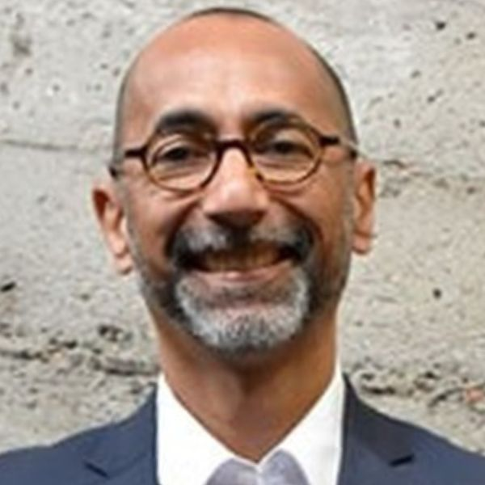
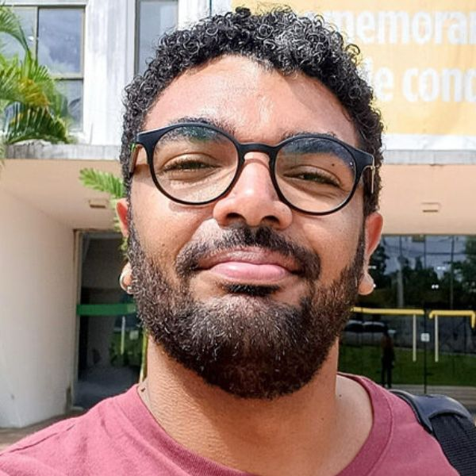

+++
title = "Estudo confirma a importância das comissões de verificação para garantir a legitimidade das políticas afirmativas nas universidades públicas"
subtitle = "Levantamento feito em dissertação de mestrado em Administração Pública da UNIFAL-MG aponta queda nas tentativas de fraude após criação de bancas de heteroidentificação"
date = "2025-10-09"
#dateFormat = "2006-01-02" # This value can be configured for per-post date formatting
author = ""
authorTwitter = "" #do not include @
cover = "capa_pesquisa_comissao_heteroidentificacao.jpg"
#Imagem ilustrativa. (Foto gerada por IA/Plataforma DALL·E 3)
tags = ["CAVANE", "Cotas", "Mestrado em Administração Pública", "Políticas Afirmativas", "Projeto +Ciência", "UNIFAL-MG"]
keywords = ["", ""]
description = ""
showFullContent = false
readingTime = false
hideComments = false
+++

A criação de comissões responsáveis por verificar a autodeclaração racial de candidatos em universidades públicas têm mostrado resultados expressivos no combate a fraudes nas cotas raciais. Uma pesquisa desenvolvida na UNIFAL-MG demonstrou que a [Comissão de Aferição da Veracidade da Autodeclaração (CAVANE)](https://www.unifal-mg.edu.br/portal/wp-content/uploads/sites/52/2019/11/Resolu%C3%A7%C3%A3o-55-2018-alterada-pela-resolu%C3%A7%C3%A3o-n%C2%BA-014-19-1-3.pdf) foi decisiva para tornar o sistema mais confiável e transparente.

O trabalho intitulado Sob a pele: o processo de heteroidentificação na graduação da Universidade Federal de Alfenas é de autoria do acadêmico Paulo Henrique Santos Pereira, desenvolvido sob a orientação do professor Jackson Wilke da Cruz Souza , que integrou o corpo docente do [Mestrado Profissional em Administração Pública (Profiap)](https://www.unifal-mg.edu.br/profiap/) oferecido pela Universidade no campus Varginha, e hoje faz parte do [Instituto de Ciência, Tecnologia e Inovação (ICTI)](https://icti.ufba.br/) da Universidade Federal da Bahia (UFBA).

Paulo Henrique Santos Pereira – autor da pesquisa. (Foto: Arquivo Pessoal)

Jackson Wilke da Cruz Souza – professor que orientou o trabalho. (Foto: Arquivo Pessoal)

A CAVANE, comissão responsável por essa validação, foi criada em 2018 na UNIFAL-MG e, para Paulo Henrique Pereira, foi um divisor de águas na Universidade. “O resultado mais impactante é a drástica queda no percentual de matrículas indeferidas”, compartilha. Ele informa que, no início do processo, em 2018, 52% das autodeclarações analisadas eram rejeitadas, número que caiu para apenas 11% no segundo semestre de 2020. Segundo o acadêmico, isso sugere que a existência da comissão diminuiu tentativas de fraude, tornando o processo mais robusto e transparente.

Apesar do sucesso da comissão, o pesquisador aponta alguns desafios, como a dificuldade de engajamento e a necessidade de capacitação contínua da banca, importante para evitar injustiças, principalmente na classificação de pessoas pardas.

Os detalhes de como a política de cotas raciais é colocada em prática na UNIFAL-MG foi compreendida cruzando a análise de documentos oficiais, com os dados numéricos e o que outros pesquisadores já sabiam da área. Segundo o autor do estudo, a pesquisa contribuiu para a legitimação e defesa das políticas de cota. “Em um cenário de constantes ataques e desinformação sobre as ações afirmativas, estudos como este fornecem dados concretos que demonstram que as universidades estão, sim, criando mecanismos eficazes para combater fraudes. Isso fortalece a política de cotas perante a opinião pública e oferece argumentos sólidos para sua defesa e manutenção”, argumenta.

Para ele, a pesquisa promove um letramento racial, uma vez que conduz a comunidade acadêmica e sociedade a discutirem o que é ser negro no Brasil. Na sua visão, isso ajuda a desconstruir a ideia de que o Brasil é uma “democracia racial”, visto que raça é uma construção social, que a partir de traços físicos,  expõe pessoas a desigualdades. “O processo move o debate da esfera privada da autoidentificação para a esfera pública da heteroidentificação, que é como o racismo opera”, esclarece.

O trabalho também contribui para o aperfeiçoamento da Gestão Pública, pois ao detalhar o processo da UNIFAL-MG, com seus acertos e desafios, oferece um roteiro que pode ser adaptado e aprimorado por outros órgãos que implementam cota racial, como concursos públicos, citados pelo pesquisador.

“Para os jovens negros que são o público-alvo da política, a existência de uma comissão robusta garante essa segurança”, afirma, acrescentando que a garantia de sua vaga e da segurança contra os fraudadores aumenta a confiança no sistema.

O próximo passo do pesquisador é levar a discussão para além do ambiente universitário. Em seu doutorado, ele pretende investigar o uso de cotas raciais em concursos públicos da magistratura federal, com o objetivo de ampliar o debate sobre justiça e igualdade de oportunidades no serviço público.

## Como a pandemia de covid-19 impactou na Comissão de Heteroidentificação na UNIFAL-MG

Os impactos da pandemia de covid-19 também foram avaliados. Para Paulo Henrique Santos Pereira, a doença trouxe tanto desafios quanto oportunidades. Com a necessidade de distanciamento social, a UNIFAL-MG e outras instituições precisaram adaptar um processo que depende da observação de características físicas, como cor da pele, textura do cabelo e formato do rosto, o que levou à implementação de entrevistas por videoconferência.

Além de manter a continuidade do processo, o formato remoto permitiu que candidatos que moram longe dos campi da Universidade participassem sem precisar arcar com custos de viagem. Para o pesquisador, essa experiência mostrou que o modelo híbrido pode tornar o sistema mais acessível e inclusivo, e ampliar as oportunidades para estudantes de diferentes regiões.

Para mais informações, acesse a dissertação [Sob a pele: o processo de heteroidentificação na graduação da Universidade Federal de Alfenas](https://bdtd.unifal-mg.edu.br:8443/handle/tede/2281), disponível na Biblioteca Digital de Teses e Dissertações da UNIFAL-MG.

*Texto elaborado sob supervisão e orientação de Ana Carolina Araújo, jornalista da Universidade Federal de Alfenas (UNIFAL-MG).*

Visite a [página da UNIFAL-MG](https://jornal.unifal-mg.edu.br/estudo-confirma-a-importancia-das-comissoes-de-verificacao-para-garantir-a-legitimidade-das-politicas-afirmativas-nas-universidades-publicas/) para acessar o texto na íntegra.