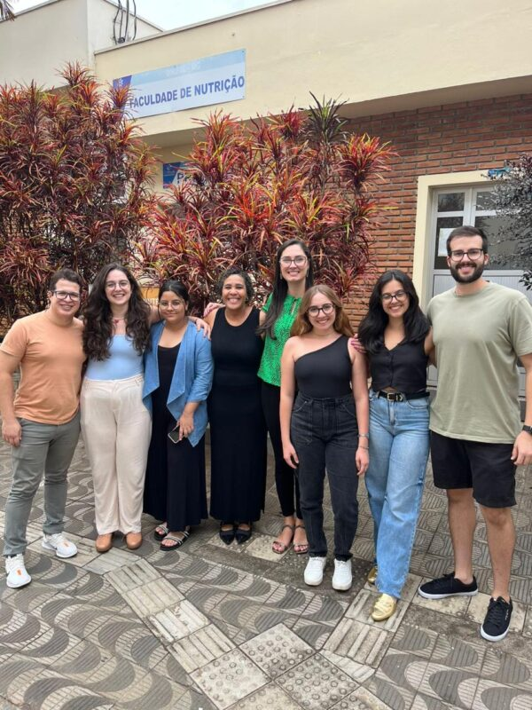

+++
title = "Pesquisa traz novos achados sobre a relação entre a perda de apetite e um ‘biomarcador’ do envelhecimento"
subtitle = "Realizado por pesquisadores da UNIFAL-MG, o estudo mostra uma relação entre a anorexia do envelhecimento e o comprimento do telômero de pessoas idosas"
date = "2025-10-30"
author = "Rafael Martins da Silva Afeto"
cover = "capa-pesquisa-anorexia-do-envelhecimento.jpg"
tags = ["Enfermagem", "Envelhecimento", "Nutrição", "PPGENF", "PPGNL", "Projeto +Ciência", "UNIFAL-MG"]
categories = ["Saúde"]
keywords = ["anorexia do envelhecimento", "telômero idosos", "biomarcador envelhecimento", "perda de apetite idosos", "pesquisa enfermagem nutrição UNIFAL"]
description = "Estudo da UNIFAL-MG descobre relação entre a anorexia do envelhecimento e o encurtamento do telômero em pessoas idosas, um biomarcador do envelhecimento."
showFullContent = false
readingTime = false
hideComments = false
+++

Pesquisa realizada pelo então discente de mestrado em Enfermagem, Ricardo Antônio Vieira, e orientada pela professora Tábatta Renata Pereira de Brito, docente dos programas de pós-graduação em [Enfermagem (PPGENF)](https://www.unifal-mg.edu.br/ppgenf/programa/) e em [Nutrição e Longevidade (PPGNL)](https://www.unifal-mg.edu.br/ppgnl/) da UNIFAL-MG, trouxe novos achados sobre um biomarcador do envelhecimento, o telômero.

Equipe envolvida na pesquisa: Ricardo Antônio Vieira (à esquerda) e outros pesquisadores com a professora Tábatta Renata Pereira de Brito (de blusa verde). (Foto: Arquivo/Tábatta Renata Pereira de Brito)

Segundo Ricardo Vieira, nas pessoas idosas avaliadas foi encontrada uma ligação entre a anorexia do envelhecimento – condição natural caracterizada pela perda de apetite em pessoas mais velhas, e o encurtamento do telômero, estrutura que atua como uma espécie de “capinha protetora” do DNA, servindo como marcadores de tempo biológico.

Para identificar essa relação, a equipe conversou com 448 pessoas com 60 anos ou mais. Usaram um questionário conhecido como “Questionário Nutricional Simplificado de Apetite (QNSA)” para entender o apetite dos participantes, separando quem apresentava a anorexia do envelhecimento ou não. Na sequência, cruzaram essa informação com os resultados das análises realizadas com amostras de sangue, onde foi possível analisar o comprimento do telômero das pessoas idosas.

Ricardo Vieira acredita que, ao fortalecer a hipótese de que o telômero pode ser um biomarcador, os resultados podem direcionar ensaios clínicos e novos estudos em terapias direcionadas ao envelhecimento. Ele também enxerga um potencial de avanço na prática de enfermagem de precisão. “Ao utilizar biomarcadores do envelhecimento, o cuidado de enfermagem passa a considerar as características biológicas de cada pessoa, tornando as decisões mais personalizadas e baseadas em evidências”, pontua.

Conforme os pesquisadores, por estarem em contato direto com pessoas idosas nos serviços de saúde, os enfermeiros exercem um papel estratégico no rastreamento da perda de apetite. O uso do QNSA por esses profissionais permite uma avaliação rápida, o que favorece a identificação precoce da anorexia e a articulação com a equipe multiprofissional, especialmente com os nutricionistas. Para o autor do estudo, essa ação conjunta favorece a adoção de hábitos alimentares saudáveis, o acompanhamento contínuo por diferentes profissionais e a educação em saúde voltada às pessoas idosas.

Os resultados da pesquisa também apresentam benefícios diretos para a população idosa. “O estudo contribui para que as pessoas idosas recebam cuidados mais individualizados e baseados em evidências, fortalecendo a promoção da saúde e a prevenção de agravos”, destaca.

O estudo faz parte da pesquisa intitulada Associação entre baixo nível de apoio social e o comprimento dos telômeros em idosos, financiada pela [Coordenação de Aperfeiçoamento de Pessoal de Nível Superior (CAPES)](https://www.gov.br/capes/pt-br), pelo [Conselho Nacional de Desenvolvimento Científico e Tecnológico (CNPq)](https://www.gov.br/cnpq/pt-br) e pela [Fundação de Amparo à Pesquisa do Estado de Minas Gerais (FAPEMIG)](https://fapemig.br/). Tais estudos estão vinculados aos programas de pós-graduação em Enfermagem e em Nutrição e Longevidade, ambos da UNIFAL-MG, e contaram também com a colaboração da Profa. Daniela Braga Lima, docente da Faculdade de Nutrição, além de pesquisadores da Unicamp, UFSCar e UFAC.

A expectativa para o projeto é a continuidade por meio de um estudo longitudinal, que acompanhe os participantes do estudo que foram avaliados, inicialmente, em 2019.

Para mais informações, a dissertação de mestrado em Enfermagem de Ricardo Antônio Vieira pode ser consultada na Biblioteca de Teses e Dissertações da UNIFAL-MG, [neste link](https://repositorio.unifal-mg.edu.br/items/2733e5f5-6f9e-4b89-810a-08330deec9ca). O artigo correspondente também estará disponível no link da publicação [aqui](https://onlinelibrary.wiley.com/doi/10.1111/jhn.13338).

*Texto elaborado sob supervisão e orientação de Ana Carolina Araújo, jornalista da Universidade Federal de Alfenas (UNIFAL-MG).*

Visite a [página da UNIFAL-MG](https://jornal.unifal-mg.edu.br/pesquisa-traz-novos-achados-sobre-a-relacao-entre-a-perda-de-apetite-e-um-biomarcador-do-envelhecimento/) para acessar o texto na íntegra.
