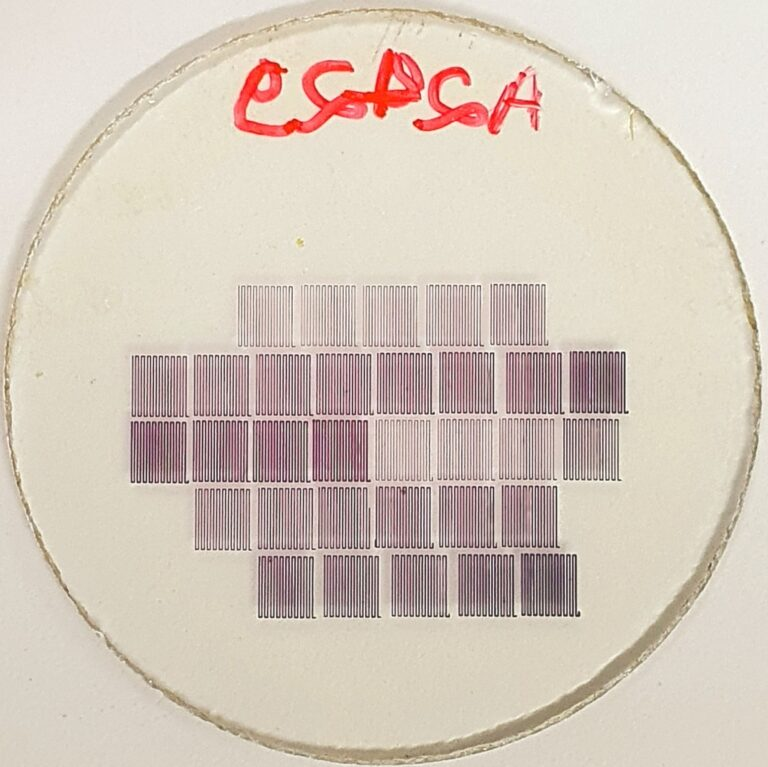

+++
title = "Pesquisa desenvolve técnica de alta precisão para produção de nanopartículas de ouro com potencial aplicação em saúde, tecnologia e meio ambiente"
subtitle = "Método desenvolvido no doutorado em Ciência e Engenharia de Materiais da UNIFAL-MG utiliza laser ultravioleta para controlar tamanho e formato das partículas"
date = "2026-01-19"
author = "Rafael Martins da Silva Afeto"
cover = "Capa_materia_tecnica-de-alta-precisao-para-producao-de-nanoparticulas-de-ouro.jpg"
tags = ["Nanopartículas", "Pesquisa", "Programa de Pós-Graduação em Ciência e Engenharia de Materiais", "Projeto +Ciência", "UNIFAL-MG"]
categories = ["Tecnologia"]
keywords = ["nanopartículas de ouro", "escrita direta a laser", "nanomateriais saúde", "PMMA nanopartículas", "pesquisa engenharia de materiais UNIFAL"]
description = "Pesquisa da UNIFAL-MG apresenta método de escrita direta a laser para produzir nanopartículas de ouro com controle preciso, com aplicações em saúde e tecnologia."
showFullContent = false
readingTime = false
hideComments = false
+++
Uma pesquisa realizada no [Laboratório de Espectroscopia Óptica e Fotônica (LEOF)](https://www.unifal-mg.edu.br/ppgf/laboratorio-de-espectroscopia-optica-e-fotonica/) da UNIFAL-MG, no campus de Poços de Caldas, apresenta um novo método para a fabricação de nanopartículas de ouro com controle preciso de tamanho, forma, densidade e concentração. O estudo é parte do doutorado de Richard Silveira Pereira, desenvolvido sob orientação do professor Marcelo Gonçalves Vivas, junto ao [Programa de Pós-Graduação em Ciência e Engenharia de Materiais](https://www.unifal-mg.edu.br/ppgcem/), e abre caminho para aplicações em áreas como diagnóstico de doenças, desenvolvimento de sensores e tecnologias ópticas avançadas.

O processo utilizado na pesquisa é conhecido como “escrita direta a laser” e consiste na aplicação de um laser ultravioleta sobre um filme fino de polimetilmetacrilato (PMMA) – um tipo de plástico transparente que contém um composto chamado sal de ouro. Ao variar a potência do laser e a velocidade com que ele percorre o material, o grupo descobriu que era possível moldar com alto controle as nanopartículas de ouro.

Filme de polimetilmetacrilato (PMMA) + nanopartículas de ouro. (Imagem: Reprodução/Pesquisa)

Esse filme fino de polimetilmetacrilato foi escolhido por apresentar vantagens como transparência, facilidade de manuseio, resistência e estabilidade frente a variações de temperatura e umidade. Segundo o pesquisador, a alta energia do laser leva o material a um estado ionizado (o quarto estado da matéria), o que permite formar nanopartículas de ouro extremamente pequenas −100 mil vezes menores que a largura de um fio de cabelo com a aglomeração de átomos do metal.

Após a produção, as nanopartículas foram analisadas por meio de simulações computacionais baseadas no chamado efeito plasmônico, que ocorre quando a luz interage com partículas metálicas em escala nanométrica.

Para explicar o fenômeno, o pesquisador utiliza uma analogia simples: “Imagine uma multidão em um show: quando a banda começa a tocar, o público passa a pular e se mover no mesmo ritmo da música”, explica. Da mesma forma, a luz (a música) faz os elétrons livres na superfície da nanopartícula de ouro (a multidão) vibrarem em um ritmo sincronizado e coletivo.

Segundo o acadêmico, os estudos em nanopartículas são recentes, mas já demonstram um grande impacto na sociedade. “Há pesquisas com nanopartículas aplicadas ao combate ao câncer e ao diagnóstico precoce do Alzheimer”, afirma. “No campo dos materiais plasmônicos, destacam-se aplicações no desenvolvimento de displays de altíssima resolução e sensores capazes de detectar vírus, bactérias e até poluentes em água de maneira rápida e eficiente”, acrescenta.

A combinação de um método de fabricação preciso com técnicas de leitura óptica rápidas e não destrutivas representa para Richard Pereira uma ferramenta promissora para o avanço científico e tecnológico. O grupo pretende, nos próximos passos, aplicar a mesma técnica a outros materiais, como nanopartículas de prata, além de explorar novas matrizes poliméricas e aplicações no desenvolvimento de sensores.

O trabalho conta com financiamento da [Coordenação de Aperfeiçoamento de Pessoal de Nível Superior (CAPES)](https://www.gov.br/capes/pt-br), do [Conselho Nacional de Desenvolvimento Científico e Tecnológico (CNPq)](https://www.gov.br/cnpq/pt-br) e da [Fundação de Amparo à Pesquisa do Estado de Minas Gerais (FAPEMIG)](https://fapemig.br/)

Os resultados foram publicados em artigo científico assinado por Richard Silveira Pereira e Marcelo Gonçalves Vivas, com a participação dos pesquisadores Diego Lourençoni Ferreira e Gabriel Ferrari de Oliveira, do Laboratório de Espectroscopia Óptica e Fotônica (LEOF) da UNIFAL-MG, em parceria com colaboradores do Instituto de Física de São Carlos: Gabriele C. Felipe de Paula, André Luís dos Santos Romero e Cleber Renato Mendonça.


  
  
  
  
  
  
  


Confira o artigo completo no site da revista científica ACS Applied Nano Materials, [neste link](https://pubs.acs.org/doi/10.1021/acsanm.5c00832).

Conheça o Laboratório de Espectroscopia Óptica e Fotônica [aqui](https://www.unifal-mg.edu.br/ppgf/laboratorio-de-espectroscopia-optica-e-fotonica/).

*Texto elaborado sob supervisão e orientação de Ana Carolina Araújo, jornalista da Universidade Federal de Alfenas (UNIFAL-MG).*

Visite a [página da UNIFAL-MG](https://jornal.unifal-mg.edu.br/pesquisa-desenvolve-tecnica-de-alta-precisao-para-producao-de-nanoparticulas-de-ouro-com-potencial-aplicacao-em-saude-tecnologia-e-meio-ambiente/) para acessar o texto na íntegra.
