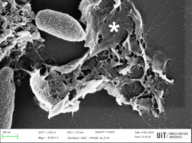

+++
title = "Nanotecnologia com vírus encapsulados amplia eficácia no combate à superbactéria associada a infecções hospitalares"
subtitle = "Desenvolvida por pesquisadores da UNIFAL-MG e da Universidade do Ártico da Noruega, a técnica se mostrou eficaz na resposta antibacteriana"

date = "2026-04-23"
#dateFormat = "2006-01-02" # This value can be configured for per-post date formatting
author = ""
authorTwitter = "" #do not include @
cover = "capa_pesquisa_nanoparticulas_superbacterias.jpg"
#Nanopartículas em interação com a bactéria Pseudomonas aeruginosa. As nanopartículas contendo o fago em processo de degradação e liberação dos bacteriófagos (estruturas menores e mais esbranquiçadas). (Foto: Arquivo/Grupo de pesquisa)
tags = ["Infecção Hospitalar", "Nanotecnologia", "PPGCF", "Programa de Pós-Graduação em Ciências Farmacêuticas", "superbactéria", "Projeto +Ciência", "UNIFAL-MG", "Universidade do Ártico da Noruega"]
keywords = ["", ""]
description = "Pesquisadores da UNIFAL-MG desenvolveram uma estratégia que pode auxiliar no combate a Pseudomonas aeruginosa, uma superbactéria responsável por infecções hospitalares graves e de difícil tratamento, utilizando vírus, que infectam bactérias, encapsulados em nanopartículas para aumentar sua eficácia e estabilidade no organismo."
showFullContent = false
readingTime = false
hideComments = false
+++

Pesquisadores da UNIFAL-MG desenvolveram uma estratégia capaz de combater a Pseudomonas aeruginosa – uma superbactéria responsável por infecções hospitalares graves e de difícil tratamento. Criada em parceria com a[ Universidade do Ártico da Noruega](https://en.uit.no/startsida) (Arctic University of Norway – UiT), a técnica utiliza vírus que infectam bactérias encapsulados em nanopartículas para aumentar sua eficácia e estabilidade no organismo.

O estudo foi desenvolvido como parte do doutorado de Gustavo Aparecido da Cunha no [Programa de Pós-Graduação em Ciências Farmacêuticas (PPGCF)](https://www.unifal-mg.edu.br/ppgcf/), sob orientação dos professores Luiz Felipe Leomil Coelho, do Instituto de Ciências Biomédicas da UNIFAL-MG, e Gabriel Magno de Freitas Almeida, da Universidade do Ártico da Noruega.

Ao aplicar a técnica de encapsulamento que envolve os fagos (VAC1) – vírus capazes de infectar e destruir bactérias – em nanopartículas de albumina bovina (BSA), os pesquisadores identificaram aumento da ação antibacteriana contra a superbactéria. A encapsulação também melhorou a estabilidade dos fagos, o tempo que permanecem ativos no organismo e sua capacidade de ação no organismo.


    
    

Nanopartículas contendo o bacteriófago encapsulado. (Imagens: Reprodução/Grupo de pesquisa)

Segundo Luiz Felipe Coelho, as nanopartículas, que medem cerca de 220 nm, foram capazes de proteger os fagos da degradação em altas temperaturas, o que permitiu a liberação gradual das partículas virais por 5 dias. “Essa estabilidade contrasta fortemente com o fago livre, cuja infectividade se perdeu após 48 horas”, explica.

A eficácia do método foi testada em ensaios in vitro, com comparação entre fagos encapsulados e não encapsulados em culturas bacterianas e testes de segurança em células humanas, e também in vivo, em modelo animal de infecção pulmonar aguda pela bactéria Pseudomonas aeruginosa. “Os resultados foram promissores tanto nos ensaios laboratoriais quanto nos experimentos com animais”, destaca o pesquisador.

Nanopartículas em interação com a bactéria Pseudomonas aeruginosa. Essas bacteriófagos que são liberados infectam a bactéria e levam ela à morte (asterisco demonstra restos de célula morta pela ação do fago). (Imagem: Arquivo/Grupo de pesquisa)

Luiz Felipe Coelho detalha que nos testes in vitro o encapsulamento potencializou o efeito antimicrobiano, o que reduziu significativamente o crescimento da bactéria e aumentou a replicação dos vírus. Já nos ensaios in vivo, embora a taxa de sobrevivência dos animais não tenha apresentado alteração, foi observada uma redução expressiva da carga bacteriana nos pulmões, além de maior recuperação de fagos viáveis e menor grau de inflamação e dano aos tecidos nas amostras tratadas.

Para o professor, o desenvolvimento de sistemas inteligentes de liberação de fagos é uma alternativa segura, biocompatível e de baixo custo para novas terapias antimicrobianas, ainda mais em um momento em que bactérias resistentes, como a Pseudomonas aeruginosa, são uma ameaça à eficácia de antibióticos convencionais.

As nanopartículas de albumina bovina, conforme relatou, podem ser produzidas facilmente e têm potencial para uso clínico em infecções respiratórias crônicas, principalmente em pacientes com fibrose cística ou doenças pulmonares resistentes a antibióticos. A abordagem também abre caminho para a criação de terapias nacionais baseadas em nanotecnologia, o que fortalece a inovação científica e tecnológica no país e reduz a dependência de insumos importados na área biomédica.

Futuramente, o grupo espera incluir o avanço dos testes em modelos de formação de biofilme em superfícies de dispositivos médicos (como cateteres e próteses) e modelos de  infecção crônica pulmonar (mais próximos das condições em pacientes humanos), além da avaliação das respostas imunológicas desencadeadas pelo uso prolongado das nanopartículas.

Os pesquisadores planejam ainda otimizar as formulações e investigar outras vias de administração (uso intranasal contínuo ou por nebulização) e encapsular outros fagos voltados a diferentes bactérias multirresistentes. “Essas etapas visam consolidar o sistema de nanopartículas de albumina como uma plataforma versátil para entrega controlada de agentes bioterapêuticos”, conclui Luiz Felipe Coelho.


  
  
  


O estudo contou com financiamento da [Fundação de Amparo à Pesquisa do Estado de Minas Gerais (FAPEMIG)](https://fapemig.br/), [Coordenação de Aperfeiçoamento de Pessoal de Nível Superior (CAPES)](https://www.gov.br/capes/pt-br) e [Conselho Nacional de Desenvolvimento Científico e Tecnológico (CNPq)](https://www.gov.br/cnpq/pt-br).

Para conhecer mais detalhes da pesquisa, acesse o artigo publicado pelos autores [neste link](https://www.nature.com/articles/s41598-026-38106-5).

Visite a [página da UNIFAL-MG](https://jornal.unifal-mg.edu.br/nanotecnologia-com-virus-encapsulados-amplia-eficacia-no-combate-a-superbacteria-associada-a-infeccoes-hospitalares/) para acessar o texto na íntegra.
